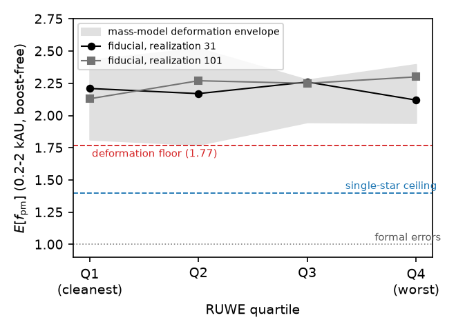

# Pair-level velocity uncertainties of Gaia EDR3 wide binaries are at least twice the formal values, independently of RUWE

**Filip Hájek** (independent researcher) — hfilip11@gmail.com

**WITHDRAWN 2026-09-03, never submitted.** The note's central claim rested on the narrow-bin f_pm meter, which failed a referee-demanded null injection (it recovers ≈ 2 from every injected truth; the statistic is prior-dominated, its grid's flat-prior mean being exactly 2.0) and whose pre-registered rebuild confirmed the bin powerless at catalog grade (calcs/stage9lb_contrast.py; ladder response 0.16 against replication scatter 0.41). There is no honest standalone version of this measurement; the surviving error-model statement is the joint-fit demand reported in the companion paper (its Section 4, Appendix A correction #21). The RUWE-flatness reading and the 1.77–2.52 mass-model envelope fall with the claim, re-read as symptoms of the same prior domination. This file is retained as a record; do not circulate or submit any part of it. The referee report that triggered the audit also identified the Lindegren et al. (2021) miscitation below (that paper states the opposite; the measured factors belong to Fabricius et al. 2021 and Brandt 2021) and the sample miscitation (the catalog is El-Badry, Rix & Heintz 2021, not El-Badry & Rix 2018); both are corrected in the companion paper rather than here.

*Draft 0.2 (2026-09-03): harmonized with the companion paper's current revision — effective, forward-model-conditional scoping made explicit; the mass-model envelope quoted in full (1.77–2.52); Boufourou (2026) engaged as the published counter-assumption; data availability updated to the now-public repository and the open Zenodo deposit. Draft 0.1 (2026-08-06), prepared for Research Notes of the AAS (1,000-word format, one figure). Numbers trace to committed stage outputs in the public repository; the figure is produced by a provenance-gated build (calcs/note_figure.py). Not for circulation until submission.*

*Acknowledgments: the computational analysis and manuscript drafting were performed in collaboration with Claude (Anthropic). A companion paper reports the full analysis these pairs feed.*

## Abstract

Gravitational tests with Gaia wide binaries depend on the catalog's formal velocity uncertainties. We report a calibration measurement on 14,071 EDR3 pairs. At projected separations of 0.2–2 kAU, where no candidate modification of gravity predicts a measurable velocity excess, a forward model that marginalizes hidden companions, eccentricities, contamination, and selection requires effective pair-level velocity errors of 2.1–2.3 times the formal values. The result is independent of RUWE quartile and survives a generous envelope of mass-model deformations (1.77–2.52), never falling below 1.77 times formal. Analyses that bin relative velocities near the formal error scale, or subtract formal errors in quadrature, inherit the difference.

## The measurement

The wide-binary test of low-acceleration gravity has produced conflicting verdicts on overlapping Gaia data (Chae 2023; Pittordis & Sutherland 2023; Banik et al. 2024; Hernandez et al. 2024; Cookson et al. 2026). These analyses consume proper-motion differences, and their statistics take the propagated formal uncertainties as the velocity error budget, sometimes after a quality cut on RUWE. Lindegren et al. (2021) document that EDR3 formal uncertainties underestimate single-star astrometric errors by magnitude-dependent factors of roughly 1.05 to 1.4. Published analyses either adopt the formal budget outright or argue that spatially correlated calibration errors are common-mode across a pair's small angular separation and largely cancel in the proper-motion difference (Boufourou 2026). Whether the two-body velocity budget is honest at that level has not been directly measured.

The sample is 14,071 pairs built from the El-Badry & Rix (2018) EDR3 catalog: chance-alignment probability below 0.01, both parallaxes above 5 mas at signal-to-noise above 20 and mutually consistent, projected separations of 0.2–50 kAU, both components on the main sequence, and formal pair velocity precision better than 0.03 km s⁻¹. The design point is that the narrowest separation bin, 0.2–2 kAU, is dynamically Newtonian for every candidate law: across the full interpolating-function and amplitude range of the companion analysis, the model boost of the bin's median velocity is below one percent. The premise is gated per realization (measured ratios 1.003–1.008 against a 1.05 bar). Whatever velocity variance this bin demands beyond the orbital model is therefore noise, not gravity.

We fit a forward population model with hidden companions (photocenter-corrected wobble), an eccentricity mixture including a radial sub-population, chance-alignment and flyby contamination, selection emulation, and a free noise scale f_pm multiplying the formal pair velocity error. The posterior of f_pm is read in the boost-free bin, per RUWE quartile (the larger component value; boundaries at the sample's quartiles).

The result: the posterior expectation of f_pm is 2.12–2.30 for every RUWE quartile in both population realizations (Figure 1), with the cleanest quartile at 2.21 and 2.13. An injected truth of 2.1 is recovered at 2.12 and 2.06. The flat quartile profile is the second finding. RUWE is a single-star fit statistic, and it does not certify two-body velocity budgets: the cleanest quartile is as underestimated as the worst.

The one modeling object the statistic depends on is the photometric mass table, which normalizes the velocity scale. A pre-registered control re-measures the meter under global mass rescalings of ×0.80 and ×1.25, tilt deformations of ±10–14% differential across the main sequence, and a tightened main-sequence window. The expectation never falls below 1.77 times formal, with the softest direction being all masses 25% high. In the companion analysis's joint fits over all separations, the posterior concentrates at the top of the noise grid, so these numbers are lower bounds in the censored direction as well.

The measured object is an effective inflation: the excess pair-level velocity variance the forward model requires, relative to the formal budget, at boost-free separations — conditional on the model's eccentricity, mass, and selection sectors, with the quantified sensitivities above, not a per-epoch instrumental calibration. Its origin, instrumental underestimation beyond the single-star factors or unmodeled population structure acting as noise in the relative velocity, is not decided by this measurement and does not matter for its use: either way it enters every normalized-velocity statistic as noise. Analyses that bin relative velocities at or below the formal error scale, or that subtract formal errors in quadrature, inherit a factor of about two.

Gaia DR4 epoch astrometry will decide the origin. If the excess is an error tail, improved per-pair uncertainties will quench it; if it is astrophysical, a per-system width term will persist while the noise scale returns toward the single-star ceiling. This discriminator is registered in the public repository before the data exist. The full analysis of these pairs, including the gravity limit this calibration feeds, is public (Hájek 2026, Zenodo: 10.5281/zenodo.22238948).

*Figure 1. The posterior expectation of the noise scale f_pm (true over formal pair velocity error) in the boost-free 0.2–2 kAU bin, per RUWE quartile, for two population realizations (points). The shaded band is the envelope over the mass-model deformation family, with its floor (1.77) dashed in red. The dotted line is the formal budget; the dashed blue line is the single-star underestimation ceiling of Lindegren et al. (2021).*

## Data availability

The catalog construction, all analysis scripts, the audited measurement ledger, and the stage outputs behind every number quoted here are public in the project repository (github.com/TheCake/thermal-horizon-rar), including the pre-registered bars for this measurement and for its DR4 discriminator.

## References

- Banik, I., et al. 2024, MNRAS 527, 4573
- Boufourou, H. 2026, arXiv:2608.24556
- Chae, K.-H. 2023, ApJ 952, 128
- Cookson, S. A., Banik, I., El-Badry, K., Sutherland, W., Penoyre, Z., Pittordis, C., & Clarke, C. J. 2026, MNRAS 547, stag342 (arXiv:2602.24035)
- El-Badry, K., & Rix, H.-W. 2018, MNRAS 480, 4884
- Hernandez, X., Chae, K.-H., & Aguayo-Ortiz, A. 2024, MNRAS 533, 729
- Lindegren, L., et al. 2021, A&A 649, A2
- Pittordis, C., & Sutherland, W. 2023, OJAp (arXiv:2205.02846)
