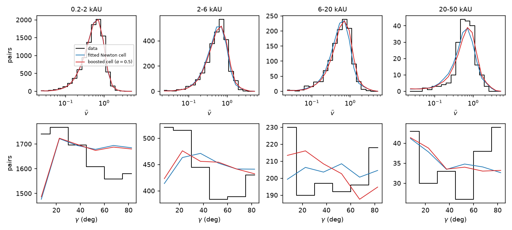
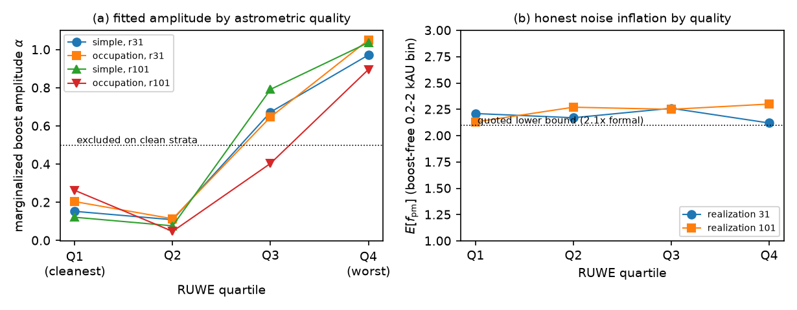
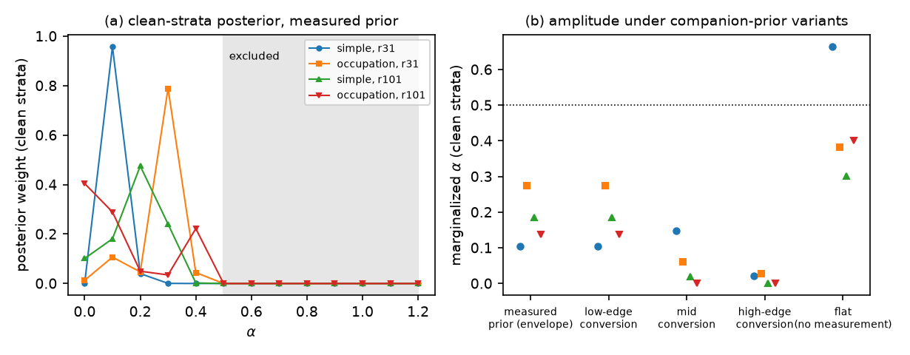
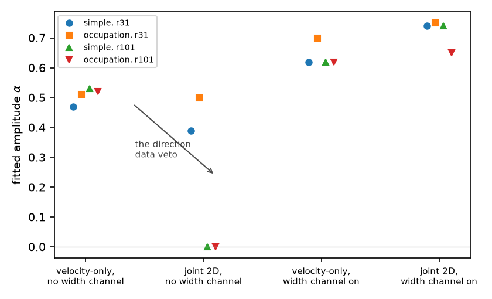
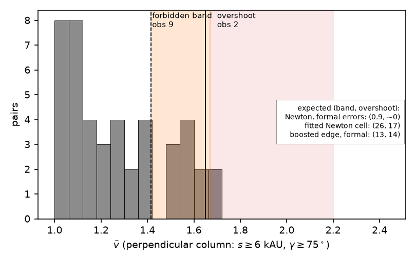
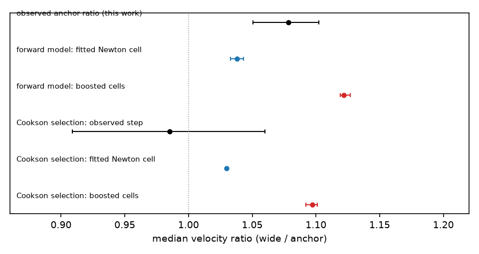

# A direction-resolved analysis of Gaia EDR3 wide binaries: pair-level velocity errors and an upper limit on the low-acceleration velocity boost

**Filip Hájek** (independent researcher) — hfilip11@gmail.com

*Draft 0.5 (2026-08-06), written from the program record (PAPER.md v4.0); all Round 14 referee items applied (correctness set, Tables 1–4, sentence pass to mean 24.0 words with maximum 49, the phantom-veto figure); companion-paper cross-references added at the pre-circulation polish. References inherit the 2026-07 INSPIRE-verified list; the three entries new to this paper (El-Badry & Rix 2018; Lindegren et al. 2021; Tokovinin 2014) were ADS-verified 2026-08-06. Figures 1–6 are produced by calcs/paper1_figures.py under provenance gates (data/paper1_figs.txt). Not for circulation.*

*Acknowledgments: the computational analysis, literature verification, and manuscript drafting were performed in collaboration with Claude (Anthropic). The full chronological program record, including all logged corrections, is public in the repository (Appendix B). A companion paper analyzes the rotation-curve and coefficient-level regime of the same program.*

## Abstract

Conflicting conclusions have been reported on whether wide stellar binaries show the velocity excess predicted by modified-dynamics theories at internal accelerations below a₀. We analyze 14,071 Gaia EDR3 wide pairs with a forward-modeled joint likelihood over the normalized relative velocity and the velocity-separation angle, marginalizing eccentricities, hidden companions, contamination, selection, and measurement noise. Three results follow. First, a calibration measurement independent of gravity: at separations of 0.2–2 kAU, where no candidate theory predicts a measurable boost, the pair-level velocity errors are at least 2.1 times the formal Gaia uncertainties, independent of RUWE; the single-star quality flag does not certify two-body velocity budgets. Second, a methodological result: without the direction channel, velocity-only fits of these data report a spurious boost of roughly half the galactic calibration, which the direction data veto. Accounting for this, for sample construction, and for noise treatment, the leading Newton-favored and MOND-favored analyses become arithmetically compatible. Third, the gravity result: after stratifying by astrometric quality, the cleanest strata exclude a boost amplitude α ≥ 0.5 (relative to the galactic calibration) at every anchoring of the measured companion-rate prior, while amplitudes up to 0.3–0.5 remain allowed and α = 0 is not excluded. A small census of perpendicular-moving pairs above the Newtonian velocity bound survives all tested contaminant identities and is released for independent scrutiny. Gaia DR4 epoch astrometry will decide both the error model and the limit.

## 1. Introduction

Rotation curves of disk galaxies follow a tight radial acceleration relation: the observed centripetal acceleration is a function of the Newtonian baryonic acceleration alone, departing from the Newtonian expectation below a₀ ≈ 1.2 × 10⁻¹⁰ m s⁻² (McGaugh, Lelli & Schombert 2016). Whether this regularity reflects galaxy formation within cold dark matter or a modification of dynamics in the spirit of Milgrom (1983) is unresolved, in part because rotation curves probe a single dynamical configuration: near-circular orbits in self-gravitating disks.

Wide stellar binaries offer a categorically different probe. Beyond several thousand AU, the internal acceleration of a solar-mass pair falls below a₀, so any modified-dynamics law calibrated on galaxies makes a definite prediction for the relative velocities, while the systems remain clean two-body problems embedded in the Galactic external field. Gaia has made samples of thousands of such pairs available, and independent analyses of essentially the same catalog have reached sharply conflicting conclusions. Chae (2023, 2024) reports a velocity boost with Newtonian dynamics rejected at up to 10σ. Banik et al. (2024) report Newtonian dynamics preferred at 16–19σ. Pittordis, Sutherland & Shepherd (2025) find Newton favored, with the stated caveat that the hidden-triple population must be better understood for the test to be decisive. Most recently, Cookson et al. (2026) find no boost signal in a median-velocity flatness test on 1,421 radial-velocity-clean pairs. All of these analyses fit or test velocity-magnitude distributions; none uses the velocity direction; and each treats the dominant nuisances (hidden companions, eccentricities, contamination, measurement noise) differently.

This paper does three things. It measures the pair-level velocity error budget of the catalog itself, using separations where no candidate theory predicts a measurable boost as an internal calibrator (Section 4). It measures the undetected-companion sector jointly from photometry and kinematics, rather than fencing it with a prior (Section 5). And it fits the gravity question with a two-dimensional likelihood in which the velocity-separation angle, a statistic immune to mass errors by construction, breaks degeneracies that velocity magnitudes alone cannot (Sections 6 and 7). The combination localizes the published disagreement: most of it is arithmetic (sample construction and error treatment), a specific part of it is a demonstrable artifact of velocity-only fitting, and what remains after both is an upper limit rather than a detection.

Our conclusions are deliberately two-sided. The data do not support the full galactic-calibration boost in this catalog once astrometric quality is accounted for: the cleanest strata exclude amplitudes at or above half the galactic value. They also do not vindicate the Newtonian null as usually stated. The same strata allow, and mildly prefer, amplitudes of 0.1–0.3. A model-light median excess over the Newton-plus-nuisances expectation persists, and a small population of perpendicular-moving pairs above the Newtonian velocity bound survives every contaminant identity we could test. The decisive systematics are named and are measurable with Gaia DR4 epoch astrometry.

The analysis was run under a bar-locking discipline: verdict thresholds and kill conditions were committed to the public repository before each deciding computation ran, and every correction made during the program is logged there (Appendix A summarizes the ones that changed conclusions). Every number in this paper is produced by a named script (Appendix B).

## 2. Data and sample

We select pairs from the El-Badry, Rix & Heintz (2021) Gaia EDR3 catalog through the sequential cuts of Table 1, yielding 14,071 pairs. Component masses come from an M_G–mass relation anchored to Pecaut & Mamajek (2013); the associated mass error is measured, not assumed, in Section 3.3.

*Table 1. Sample selection (cuts applied sequentially; counts from calcs/paper1_figures.py).*

| Cut | Pairs surviving |
|---|---|
| El-Badry, Rix & Heintz (2021) catalog | 1,817,594 |
| chance-alignment probability R_chance < 0.01 | 1,148,051 |
| both parallaxes > 5 mas | 111,391 |
| parallax signal-to-noise > 20 (both components) | 100,432 |
| parallax consistency within 3σ | 95,019 |
| projected separation 200 AU to 50 kAU | 78,789 |
| both components on the main sequence (2.6 < M_G < 14.2) | 74,502 |
| pair velocity precision < 0.03 km s⁻¹ | 14,071 |

Two observables are formed per pair. The first is the normalized relative velocity ṽ = Δv_sky / v_c(s), the sky-projected relative velocity in units of the circular velocity at the projected separation; bound Newtonian pairs satisfy ṽ ≤ √2 identically. The second is the folded angle γ ∈ [0°, 90°] between the separation and relative-velocity vectors on the sky (the v–r angle of Tokovinin 1998 and Hwang, Ting & Zakamska 2022). The angle is constructed from directions only and is therefore immune to the mass normalization by construction; this property is what gives it its diagnostic power in Section 7.

Where catalog radial velocities exist they are used to remove the systemic-velocity perspective term from the proper motions pair by pair (Section 9.2). The joint statistic is a multinomial likelihood over a 20 × 6 grid in (log ṽ, γ), evaluated in four separation bins (0.2–2, 2–6, 6–20, and 20–50 kAU), with per-pair measurement noise drawn from the data and convolved into every model template before comparison.

## 3. The forward model

### 3.1 Populations and gravity

Model populations of 10⁶ binaries per likelihood evaluation are generated by a GPU orbit integrator under either Newtonian dynamics or a boosted law g = g_N B(y), with the boost interpolated from external-field-effect tables produced by an axisymmetric QUMOND solver (Milgrom 2010). The solver passes a spherical-symmetry identity at the 0.01% level, tracks the Chae & Milgrom (2022) fitting formula, and is cross-validated at the 15% level against the published solar-system quadrupole of Blanchet & Novak (2011). Boost tables are computed for two interpolating families that bracket the functions used in the wide-binary literature: the widely used "simple" function and a sharper "occupation" function. Both are drawn from the program's galaxy-side analyses, presented in a companion paper, and are treated here purely as boost templates; y = g_N/a₀ denotes the Newtonian acceleration in units of a₀. The boost strength is parameterized as B_α = 1 + α(B − 1), so that α = 0 is Newton and α = 1 is the parameter-free galactic calibration.

The external field requires care with conventions. The appropriate input to a QUMOND solver is the Newtonian external field; inverting the radial acceleration relation at the solar circle gives g_N,ext = 1.15 ± 0.05 a₀. The AQUAL-convention total field used in other analyses is larger by roughly 60%, and importing it unconverted biased five generations of our own fits before the error was caught (Appendix A). The Newtonian-equivalent field of Cookson et al. (2026), 1.184 a₀, agrees with our conversion to 3%.

### 3.2 Nuisance sectors

The nuisance model comprises six sectors, each tied to a measurement described in this paper or an external one (Table 2).

*Table 2. Nuisance sectors of the forward model.*

| Sector | Parameterization | Constraint | Where measured |
|---|---|---|---|
| eccentricity mixture | separation-interpolated power family plus a near-parabolic component of weight w_rad, e ∈ [0.9, 0.995] | w_rad = 0.20 fitted; external check moves α by < 0.01 | Section 6.2; Hwang et al. (2022) |
| undetected companions | Raghavan et al. (2010) period and multiplicity statistics per component; photocenter-corrected wobble (Section 5.3); hidden mass; proper-motion suppression of long periods; resolution limits | fraction marginalized under the measured prior band | Section 5 |
| contaminants | chance-alignment and flyby templates with distinct two-dimensional signatures, scaled with separation | weights fitted; rejected on shape where tested | Section 3.2 |
| measurement noise | scale factor f_pm on the formal proper-motion errors | at least 2.1, measured on the boost-free bin | Section 4.1 |
| per-system width | fractional velocity smear s_q, direction-neutral by construction | 0.2 demanded by the pooled sample; dissolves under quality stratification | Sections 6.1, 6.3 |
| selection | the catalog's velocity-consistency acceptance, measured from the data | applied to models and templates alike | Section 3.2 |

The model reached this form through seven generations of hypothesis testing, each falsifying its predecessor's explanation of the excess velocity width; the chronology is in the program record. Three identity measurements from that process carry directly into what follows.

### 3.3 Measured nuisance identities

First, the mass error is measured, not assumed. The photometric main-sequence width gives a fractional mass error of 0.024, twelve times smaller than the velocity broadening it was once hypothesized to cause; the mass-error explanation of the width is refuted at that factor.

Second, the eccentricity sector is externally validated. The fitted near-parabolic weight, w_rad = 0.20, was selected in every fit variation tried (more than thirty), and matches the e > 0.9 mass fraction of 20.4–21.7% implied by the independently measured superthermal eccentricity law of Hwang, Ting & Zakamska (2022) on the same catalog. Freezing w_rad to their value moves the fitted boost by less than 0.01, so the conclusions do not lean on the internal fit of this sector.

Third, the excess width of the ṽ distributions has been given an identity piece by piece. Mass errors are refuted above. A circular sub-population is vetoed by the joint fit (circular orbits narrow ṽ). Companion broadening is rejected on shape. What remains real: the near-parabolic population, demanded independently by the direction channel; a per-system width channel, demanded by the pooled data at s_q = 0.2 (Section 6.1); and pair-level noise beyond the formal errors, measured in Section 4. The last two absorb what earlier phenomenological smears had absorbed. Their separation from the boost is exactly what Sections 6 and 7 are about.

*Figure 1. The joint observables in the four separation bins. Top row: normalized relative velocity ṽ; bottom row: velocity-separation angle γ. The histogram is the data; the curves are the forward model at the fitted Newtonian configuration (blue) and at a boosted configuration with α = 0.5 (red), both evaluated at the landed nuisance cell (realization 31, simple family; provenance in data/paper1_figs.txt). The velocity marginals barely separate the two worlds; the direction marginals carry the residual structure discussed in Sections 7 and 8.*

## 4. The pair-level velocity error budget

### 4.1 A boost-free calibrator

The narrowest separation bin, 0.2–2 kAU, is effectively Newtonian for every candidate law: the model boost of the bin's median velocity is 0.3–0.8% across the full function and amplitude grid (a gate on this premise excluded the adjacent 2–6 kAU bin, whose model boost reaches 5–8%, from the calibrator). Whatever noise inflation the kinematics of this bin demand is therefore honest instrument noise rather than absorbed signal. Fitting the per-stratum noise parameters on this bin alone, with the boost fixed off and the eccentricity sector held at its fiducial values, returns an expected proper-motion error inflation of E[f_pm] = 2.21 and 2.13 for the two population realizations. An injection test recovers a known inflation of 2.1 at 2.12 and 2.06. Varying the eccentricity assumption moves the answer by less than 0.1.

Two properties of this measurement matter downstream. It is flat across astrometric quality: splitting the sample into RUWE quartiles gives E[f_pm] between 2.12 and 2.30 in every quartile, for both realizations. And it is a lower bound: a substantial fraction of the posterior mass sits at the top of the inflation grid, so we quote the result as pair-level velocity errors of at least 2.1 times the formal Gaia uncertainties at 0.2–2 kAU. A pre-registered control also closes the mass-model objection: re-measuring the meter under global mass rescalings of ×0.80 and ×1.25, tilt deformations of ±10–14% across the main sequence, and a tightened main-sequence window keeps the expectation above 1.77 times formal in every case, so the inflation is not an artifact of the photometric mass table.

We believe this number is useful to any analysis of the catalog, independent of the gravity question. The RUWE statistic certifies the single-star five-parameter astrometric solutions; it evidently does not certify the error budget of the relative velocity of a resolved pair, which is sensitive to error channels (local systematics, covariances between nearby sources, scan-geometry effects) that single-star quality cuts do not address. The same inflation is demanded by the full joint fit at all separations, which is what makes the subtraction in Section 6 legitimate rather than circular: the noise level used there is measured where the signal cannot be.

### 4.2 The residual shape question

One aspect of the noise model remains genuinely open. When the inflation grid is extended to 3.0 times formal, the full-sample posterior migrates toward the new edge in both interpolating families, ceding about 8 log-likelihood units and up to 0.06 of the fitted amplitude. No injected population reproduces this behavior: mock skies carrying the measured companion population, the demanded width channel, and the measured inflation put less than 2% posterior mass at the extended edge, against 54–97% on the real sky. The sky therefore contains a residual velocity-width structure that scale inflation of Gaussian errors does not capture. Two pre-registered alternative shapes (an error-independent velocity floor and a heavy-tail fraction) failed their acceptance bars. Locating diagnostics place the residual in the mid range of the velocity distribution and the radially oriented column of the inner separation bins, not in any tail. Whether this is non-Gaussian error shape or unmodeled population structure is the principal attribution question that Gaia DR4 epoch astrometry can settle, and the fitted amplitudes below are quoted with the sensitivity band this ambiguity implies.

*Figure 2. (a) The marginalized boost amplitude per RUWE quartile, for both interpolating families and both population realizations (Section 6.3); the dotted line marks the α = 0.5 level excluded on the clean strata. (b) The noise inflation demanded by the boost-free 0.2–2 kAU bin, per quartile: flat at approximately 2.2 times the formal errors, independent of astrometric quality.*

## 5. The companion sector, measured

### 5.1 Photometric completeness and a coherence discovery

Undetected companions are the nuisance on which the published analyses divide most sharply, so we attempted to measure the sector rather than bound it. A first completeness analysis modeled the single-band overluminosity distribution of the 28,142 component stars as a mixture of single-star scatter and unresolved-companion displacement, inferring the completeness of the standard overluminosity flag and, by inversion, the underlying multiplicity. Its validation test then overturned its scale (Appendix A): the within-pair correlation of overluminosity residuals is ρ = +0.47 on the discriminating color-separated slice (+0.24 over all pairs), whereas true companions displace one component at a time. Wide-pair components are coeval and co-chemical, so metallicity, age, and extinction move both components' photometry together; roughly half of the apparent single-star spread is this common mode, and a one-dimensional mixture reads it as companions. The correlation is flat in angular separation from 2 to 250 arcseconds, which excludes blending as its origin, and it rises with distance as an extinction and metallicity effect should. We record it as a measurement in its own right: wide-pair photometry is pair-coherent at the half-variance level, and any single-star calibration applied per component will misread it.

The repaired analysis models the pair jointly, with a common-mode displacement whose coherence decays with the color separation of the components (measured: ρ = 0.86 for near-twins, 0.36 for very unequal pairs; the pair-shared displacement is a vector quantity, projected differently onto unequal masses). Under this model, deliberately companion-free mock skies return a companion fraction of exactly zero even when the common mode is mis-specified, which acquits the estimator of the over-attribution failure mode. On the data it returns a blended companion fraction per component of f = 0.159, stable across three common-mode model classes, three integration schemes, and every optimizer start tried, corresponding to a host-star subsystem fraction of 0.29–0.32 under a flat mass-ratio convention.

### 5.2 The mass-ratio distribution, and what the rate means kinematically

The same likelihood measures the shape of the inner-subsystem mass-ratio distribution, and the result resolves what would otherwise be a factor-of-three tension with published subsystem rates (Tokovinin 2014; El-Badry & Rix 2018). The photometry prefers a twin-concentrated law over a flat one by 162 log-likelihood units, and over a low-mass-ratio-weighted law by 267. Twin companions are photometrically loud but astrometrically quiet: the photocenter of a near-equal pair barely wobbles. Converting the measured host rate through the measured mass-ratio shape gives a kinematically effective companion fraction of roughly 0.10–0.15, consistent with what the velocity data independently prefer, and close to the field rates when compared in the same convention. The conversion factor between the photometric and kinematic conventions spans 0.10–0.39 across mass-ratio brackets, and this band, rather than any single number, is what enters the gravity fit as the companion prior.

### 5.3 The wobble amplitude law

One model error with field-wide relevance surfaced in this sector. The companion velocity-wobble amplitude used in the published wide-binary analyses scales as q/(1+q). This omits photocenter cancellation: an unresolved companion displaces the photocenter as well as the barycenter, and for equal luminosities the two displacements cancel exactly, so the observable wobble amplitude is |q/(1+q) − ℓ/(1+ℓ)| with ℓ the luminosity ratio. Fits using the uncancelled law are internally inconsistent at any realistic multiplicity. Forcing our fit to carry defensible host rates under that law costs of order 100–500 log-likelihood units against its own optimum: about 100–170 at the literature subsystem rate, 300–500 at the measured rate, and up to about 1000 at the since-retracted higher scale of Appendix A. This inconsistency is why earlier generations of our own analysis had capped the companion fraction near 0.1. All results below use the corrected law.

## 6. The gravity fit

### 6.1 The marginalized amplitude before quality stratification

With companions, eccentricities, contaminants, noise inflation, the width channel, and the wobble amplitude marginalized jointly, the fitted boost amplitude is α = 0.74 (simple family) and 0.70 (occupation family), at 23.8 and 23.2 log-likelihood units over Newton. The answer is independent of the companion prior: the amplitude moves by 0.01–0.03 as the prior anchor is scanned across the entire plausible range (0.06–0.34), because the likelihood itself constrains the effective companion fraction. The per-system width channel is demanded by the data (posterior probability of s_q > 0 is 1.00, with the scale localized at 0.2), and with it active the old dichotomy between companion-win and boost-win configurations disappears; both lived in the width-free slice of the model space. Against the pre-registered detection threshold (amplitude at least 0.5 with Δ lnL at least +25), this fit falls short by 1.2–1.8 units and is classified as ambiguous rather than as a detection. Extending the noise grid (Section 4.2) yields the sensitivity band α = 0.68–0.74 at Δ lnL = +14.5–23.8; under the physical Gaia error envelope alone the same fit reads α = 0.80 at Δ lnL = +35, so the operative numbers are noise-diluted rather than noise-protected. Injection–recovery tests at this configuration behave correctly. A null sky with companions at twice the kinematically preferred rate returns α = 0.00 in both families. Injected amplitudes are recovered conservatively: 0.65 and 0.64 for injected 0.74 and 0.70, while the low-amplitude discriminator arm reads an injected 0.40 as 0.48 with profile and marginal coincident and its companion arm under-recovers at 0.27.

### 6.2 The eccentricity sector

The direction data fix the eccentricity mixture independently of the gravity law. The fitted near-parabolic weight w_rad = 0.20 agrees with the external Hwang, Ting & Zakamska (2022) measurement (Section 3.3), the posterior for the weight collapses onto a single grid node once the direction channel is active, and freezing the sector externally changes the amplitude by less than 0.01. The boost measurement does not lean on the eccentricity fit.

### 6.3 Quality stratification: the dose curve and the clean-strata limit

The preceding fit treats astrometric quality implicitly, through the error model. Treating it explicitly changes the conclusion, and this is the paper's central negative result. Splitting the sample into RUWE quartiles and re-fitting with per-stratum noise parameters shows, first, that the single width channel of Section 6.1 is a quality artifact: pooling heterogeneous strata manufactures it. The cleanest quartile requires no per-system width at all, and the upper three plateau near 0.1. Fitting one width to the pooled sample roughly doubles it. Second, the fitted amplitude concentrates in the poor-quality strata. The two cleanest RUWE quartiles return comparable low amplitudes (0.12–0.26 and 0.05–0.11, mutually inverted within the two-realization scatter, so the ladder is ordered by amplitude rather than strictly by quartile); the third quartile rises to 0.40–0.79 and the worst to 0.90–1.05 (Table 3; Figure 2). Dropping the worst quartile zeroes the block-level amplitude in every family and realization. Marginalizing instead of profiling confirms the pattern: with all strata included the amplitude is approximately 0.5 with modest Newton contrast, while the three cleaner quartiles alone prefer Newton over any amplitude at or above 0.5 by 13–20 log-likelihood units. Even the cleanest strata continue to demand approximately twice the formal errors.

*Table 3. Quality-stratified results (ranges span the two interpolating families and two population realizations).*

| RUWE quartile | marginalized α | per-system width | E[f_pm] (boost-free bin) |
|---|---|---|---|
| Q1 (cleanest) | 0.12–0.26 | ≈ 0 | 2.13–2.21 |
| Q2 | 0.05–0.11 | ≈ 0.1 | 2.17–2.27 |
| Q3 | 0.40–0.79 | ≈ 0.1 | 2.25–2.26 |
| Q4 (worst) | 0.90–1.05 | ≈ 0.1 | 2.12–2.30 |

A fitted amplitude that rises with astrometric badness admits two readings: noise dressing as boost in the dirty strata, or a real signal that dirty strata exaggerate. The boost-free calibrator of Section 4.1 decides between them, because it measures the noise where no signal can be: the honest noise level equals the level the joint fit uses. The subtraction is legitimate, the pedestal in the model-light median (Section 6.4) is real noise, and the clean-strata result stands as the operative one.

A fine amplitude scan (step 0.1, with a power gate demonstrating recovery of an injected α = 0.3 through the same machinery) completes the statement. The clean strata allow and mildly prefer amplitudes of 0.1–0.3, at +1.5 to +6.5 log-likelihood over Newton in three of the four family-realization combinations; α = 0 is not excluded. The dependence of this allowed sector on the companion prior was mapped explicitly by re-marginalizing under the prior pinned at each edge of the measured conversion band and under a flat prior. The exclusion of α ≥ 0.5 holds at every anchoring of the measured prior, and it strengthens as the conversion factor rises: from 13 to 61 log-likelihood units across the band. The interior 0.1–0.3 preference is the reading at the low-conversion edge, and it tightens toward α = 0 at mid and high conversion. Only a flat prior revives larger amplitudes (marginalized values of 0.30–0.66, with the Newton contrast returning at +11 to +16), because discarding the companion-rate measurement readmits the companion-free world. The clean-strata kinematics themselves cap the effective companion fraction near 0.1 regardless of the prior's permissiveness. Table 4 assembles the amplitude ladder across configurations.

*Table 4. The two-sided limit: the fitted amplitude across error-model and prior configurations.*

| Configuration | α (simple / occupation) | ΔlnL over Newton |
|---|---|---|
| full sample, physical Gaia error envelope | 0.80 / 0.80 | +35.2 / +32.3 |
| full sample, operative (noise grid to 3.0) | 0.68–0.74 | +14.5 to +23.8 |
| clean strata (Q1–Q3), measured prior | 0.1–0.3 allowed; α ≥ 0.5 excluded | +1.5 to +6.5 at the peak (3 of 4 reads) |
| clean strata, high-conversion anchoring | prefers 0 | α ≥ 0.5 excluded by 25–61 |
| clean strata, flat (measurement-free) prior | 0.30–0.66 | +11 to +16 |

*Figure 3. (a) The clean-strata posterior over the boost amplitude under the measured companion prior, for both families and both realizations; the shaded region is excluded in every case. (b) The marginalized amplitude under the five companion-prior treatments of Section 6.3. The exclusion of α ≥ 0.5 holds at every anchoring of the measured prior; only the flat, measurement-free prior revives larger amplitudes.*

The gravity result of this paper is therefore an upper limit with a floor that is not yet a detection. A boost of α ≥ 0.5 is excluded on the clean strata at every anchoring of the measured companion-rate prior. Amplitudes up to 0.3–0.5 remain allowed, with a mild interior preference for 0.1–0.3 whose strength is prior-dependent in the stated direction. The Newtonian value α = 0 is not excluded. We commit to a promotion condition for any stronger claim: a demonstration that a truly Newtonian sky, processed under a mis-specified error shape at the measured twofold scale, does not manufacture the small-amplitude preference. That demonstration has not been run, and the language of this paper respects it.

### 6.4 The model-light median

The median-velocity ratio between the deep bins and the Newtonian-regime anchor bins, a statistic immune to population-realization scatter and to any symmetric per-system smear, is 1.078 (68% CI 1.052–1.103) after the per-pair perspective correction (Section 9.2; 1.086 before it). The perpendicular-velocity version, immune to the perspective term by construction, is larger (1.151, CI 1.115–1.197) and survives the strictest multiplicity cleaning the catalog supports. Forward-producing this statistic at the best Newtonian configuration (companions, noise, and width at their fitted values) yields 1.033–1.043: the absorbers cover roughly half the observed excess, and the boosted configurations overproduce it (1.114–1.127). These ratios are model-referenced: the forward model's own Newtonian zero point on this statistic is approximately 0.98 rather than 1.000, because the fitted eccentricity distribution runs with separation, and the quoted values fold that baseline in. The median is thus no longer a standalone discriminator in either direction; it stands as a model-light excess of 0.035–0.045 over the Newton-plus-nuisances expectation, consistent with the small-amplitude sector the likelihood allows.

## 7. What velocity-only fitting does to these data

The direction channel's value is demonstrated most sharply by removing it. Re-fitting the full model on the velocity magnitudes alone, in the configuration every published analysis occupies (no per-system width channel), returns a spurious amplitude: ṽ-only fitting reports α ≈ 0.50 at Δ lnL = +12 to +13, which the direction data veto down to 0.20–0.25 at +2 to +4. The mechanism is absorber confusion. Excess velocity width has four candidate carriers with different directional signatures: a boost scales ṽ at fixed direction structure, near-parabolic orbits concentrate the angle distribution, companions flatten it, and noise broadens nearly isotropically. Velocity magnitudes cannot separate these; the angle can. With the width channel active the amplitude becomes channel-robust (ṽ-only and joint fits agree to within 0.12) and the direction data instead pin the nuisance sector, collapsing the eccentricity-weight posterior onto a single node.

We state the implication for the field plainly. On this catalog, a scalar-velocity analysis with standard error modeling can manufacture half a galactic-calibration boost from the width budget, and the direction data are what catch it (Figure 6). Analyses on either side of the published disagreement are exposed to this degeneracy to the extent that they fit velocity distributions with the eccentricity sector, the companion sector, or the noise model free.

*Figure 6. The phantom veto. Fitted amplitudes in the four analysis configurations, for both families and both realizations. In the width-free configuration occupied by published scalar-velocity pipelines (left pair), velocity-only fitting reports α ≈ 0.5 which the joint two-dimensional fit vetoes toward zero. With the width channel active (right pair), the two channels agree and the amplitude is channel-robust.*

## 8. The perpendicular census

A bound Newtonian pair can never exceed ṽ = √2, at any eccentricity or phase. This bound and the discriminating power of the band above it are the field's founding observables (Pittordis & Sutherland 2018; Banik & Zhao 2018). The reason they have not been decisive is contamination: in the full sample the band above √2 is dominated by flybys and multiples, to the point that Banik (2019) proposes the population as a contamination diagnostic. Our contribution is the column of the (ṽ, γ) plane where that degeneracy breaks. Among wide pairs (s ≥ 6 kAU) moving nearly perpendicular to their separation vector (γ ≥ 75°), flyby geometry is disfavored, the direction channel has independently fixed the eccentricity mixture, and a boosted law raises the ceiling to √(2B) ≈ 1.65 at the galactic calibration.

The observed column, under the perspective-corrected convention: nine pairs occupy the Newtonian-forbidden band [1.414, 1.67), two sit in the overshoot region [1.67, 2.2), and none lie beyond. At the formal noise level a true Newtonian edge predicts approximately one pair in the band; the Poisson probability of nine or more at that expectation is 5 × 10⁻⁷ (the uncorrected convention places eleven pairs in the band, at probability 3.8 × 10⁻⁹). A boosted edge at 1.65 predicts the observed occupancy and the observed termination. The pair of numbers defends itself against the obvious rejoinder. If the noise were large enough to leak nine pairs across √2, it would also populate the overshoot region. The fitted Newtonian configuration of Section 6, forward-modeled, floods both regions: 17–32 pairs expected beyond 1.67 against the 2 observed, with the probability of two or fewer at most 7 × 10⁻⁶. No configuration we searched, including the boosted ones with inflated noise, reproduces nine in the band with a cliff at two. One cannot simultaneously hold the noise needed to fake the band and the sharpness of the observed termination.

The census survived a dedicated adversarial campaign. Heavy-tailed error manufacture at any severity and fraction fails to reproduce it (the required tail turn-on sits far above the measured error tails). Repairs aimed specifically at each flank (bulk-variance flooding of the band; the measured subsystem period law aimed at the cliff) are each excluded, the latter refused by the kinematics. Search-based caveats are stated: these are exclusions over the fitted model family and its posterior neighborhood, not over all conceivable error models. At the object level, all nine band pairs are clean in the Gaia non-single-star tables, and an external spectroscopic-archive search finds no companion signatures at its (thin) coverage. The astrometry of the band pairs is better than the sample average (median maximum RUWE 1.06, against 1.28 for the low-angle continuum at the same velocities), and their chance-alignment probabilities are of order 10⁻³ to 10⁻⁴. Field-star flybys at closest approach would arrive at normalized velocities of order 100, not 1.5, and would have no ceiling. The low-angle unbound continuum indeed runs smoothly past ṽ = 3, which also demonstrates that the catalog's selection is not the cliff.

We release the census pair by pair (data/ceiling_pairs.csv): Gaia EDR3 source identifiers, both velocity conventions, per-pair noise, direction signal-to-noise, RUWE of both components, chance-alignment probability, and parallax consistency, sufficient to re-count the band under any edge, angle, or noise convention without our pipeline. Eleven pairs occupy the band under the uncorrected convention; boundary pairs relocate by one under reimplementation, and the formal-noise leakage probability stays between 3.8 × 10⁻⁹ (eleven pairs) and 5 × 10⁻⁷ (nine) across the conventions. The census is small, and we do not rest the paper on it. It is, however, the one statistic in this dataset that no tested combination of noise, companions, and selection reproduces, and Gaia DR4 multiplies the column's occupancy roughly tenfold: the band fills and the cliff stays at 1.65, or the boosted reading of this census is wrong.

*Figure 4. The perpendicular column (s ≥ 6 kAU, γ ≥ 75°): the observed ṽ histogram with the Newtonian-forbidden band and the overshoot region shaded, and the boosted escape edge at 1.65 marked. The inset lists the expected (band, overshoot) occupancies for the three model worlds; none reproduces the observed pair (9, 2).*

## 9. Reconciling the published analyses

### 9.1 The ablation map

We reproduced the principal Newton-favored modeling choices inside our own pipeline, one at a time, against our fenced-model baseline. Removing the direction channel leaves the fenced detection intact but degrades the measurement (the amplitude unpins from its calibrated value and the eccentricity weight drifts). Unfencing the companion fraction absorbs roughly 60% of the fenced Newtonian rejection. Adding the anchor-bin removal and window restriction of Banik et al. (2024) removes two thirds of the significance and biases the amplitude low. Our original normative reading of this map claimed the Newton-favored result was manufactured by a photometrically forbidden companion fraction; that reading was retracted when our own completeness measurement showed the flagged rate is not a bound (Appendix A). What survives is specific. The fitted 69% triple fraction of Banik et al. exceeds every defensible calibration; it is excluded at high confidence under the measured multiplicity, and by roughly 2000 log-likelihood units in our two-dimensional likelihood even under their own amplitude law. The shared wobble amplitude law omits photocenter cancellation (Section 5.3). And the sub-error binning without noise convolution, identified by Hernandez, Chae & Aguayo-Ortiz (2024), is a real defect that our always-convolving pipeline cannot even reproduce.

### 9.2 The perspective term

Cookson et al. (2026) identify a projection term absent from our program's earlier stages: the systemic radial velocity produces a spurious on-sky relative velocity directed along the separation vector, growing steeply with separation, in other words shaped like a signal. We audited it immediately (Appendix A). The effect is present in our data at its predicted size (regression slope 0.92 against the prediction of 1). It is too small to be the signal: Newton plus perspective predicts an anchor ratio of 1.016, against the observed 1.086. The perpendicular velocity component, immune by construction, shows a stronger excess than the full statistic. Correcting the term per pair with the catalog radial velocities moves the anchor to 1.078 and the fitted amplitudes by less than 0.03. All quoted results use the corrected velocities.

### 9.3 The flatness null, quantified on the same catalog

We rebuilt the Cookson et al. selection inside our catalog (N = 1194 against their 1,421, a 16% proxy discrepancy from catalog-version differences) and ran both directions. Their statistic on our data replicates their result: the median-velocity step across their normalized-separation range is 0.985 (CI 0.909–1.060), flat. Their statistic on our model shows why this is not discriminating: the boosted configurations of Section 6, forward-modeled through their selection and their statistic, predict a step of 1.09–1.10 rather than the naive 1.20, because the measured eccentricity trend, the marginalized nuisances, and their velocity ceiling each suppress it. Their 2.7σ rejection of a 20% step is therefore approximately 1.3σ against what the fitted model actually predicts, and the boost-versus-Newton separation available in their cleaned sample is below 1σ on either statistic. The two results are arithmetically compatible; the disagreement resides entirely in the 92% of the joint sample their cleaning removes, including every deep-anchor pair. That question is empirical, and we measured it: applying the completeness and width machinery of Sections 4–6 to the removed subsample shows its kinematics do not decompose into the measured companion and noise sectors; the removed pairs alone return marginalized amplitudes of 0.62–0.85 at 21–26 log-likelihood units over Newton. At this instrument's grade the removed pairs carry data, not contamination, though after Section 6.3 the data they carry is the upper-limit sector, not the 20% step their test was powered against.

### 9.4 Where the field's disagreement stands

Assembling the pieces. The Chae detections and the Banik et al. null differ mostly through the companion sector. The free 69% is excluded, but the fenced 0.1 was also untenable as a prior; the measured sector, converted through the measured mass-ratio law, lands near the kinematic preference. The Cookson et al. null is real but sits in a cleaned sample whose boost sensitivity we measure at below 1σ against the fitted model. The Pittordis, Sutherland & Shepherd null rests on comparably aggressive cleaning whose sensitivity we have not re-measured. The velocity-only degeneracy of Section 7 can move any of these analyses by half a calibration unit in either direction, depending on which absorbers are free. And every analysis, including ours, inherits pair-level errors at least twice the formal values. Within this accounting there is no contradiction among the published numbers, only different placements of the same width budget. The measurements that would collapse the accounting into a verdict are listed in Section 10.

*Figure 5. Median-ratio statistics against forward-modeled expectations. Top group: this work's anchor ratio (with bootstrap interval) against the fitted Newtonian and boosted configurations, which bracket it. Bottom group: the same comparison on the Cookson et al. selection, where the observed step is flat and the model separation is below one sigma.*

## 10. Discussion

### 10.1 What this catalog can and cannot decide

The limiting systematic of the wide-binary test in EDR3 is not companions, which can be measured (Section 5), and not eccentricities, which are externally validated (Section 6.2). It is the pair-level error model. The errors are at least 2.1 times formal at the calibrator separations, quality-independent, with a residual width shape that neither Gaussian inflation nor the tested alternatives capture. In the presence of that object, the clean-strata analysis bounds the boost from above at half the galactic calibration but cannot resolve the 0–0.3 sector, and the model-light statistics (the median excess, the perpendicular census) remain unabsorbed but small. We consider the in-catalog analysis of this sample substantially complete: further re-slicing of EDR3 is unlikely to move the answer.

Three external measurements would. Gaia DR4 epoch astrometry resolves the pair error model directly (per-epoch residuals expose both the scale and the shape of the excess, and the astrometric-companion channel), multiplies the perpendicular census tenfold, and provides the eccentricity resolution that separates trajectory-level from field-level boost prescriptions. Targeted spectroscopy of the census pairs tests their multiplicity to depths the archives do not reach. And a subsystem-rate measurement at 0.2–50 kAU with controlled completeness would replace the conversion band of Section 5.2 with a number.

### 10.2 A methodological note on population realizations

Distribution-level likelihoods over simulated binary populations carry a realization systematic: the finite draw of orbital elements shifts log-likelihoods by more than the Newton-versus-boost gap unless marginalized. Our budgets marginalize six independent realizations and report the scatter. We are not aware of a published quantification of this effect; analyses that fit distribution shapes against a single simulated population inherit an unquantified systematic of exactly the disputed magnitude.

### 10.3 Credence

This program tracks an explicit credence that the wide-binary anomaly is real physics, updated only through maps committed before each deciding computation. After the analyses reported here it stands at approximately 53%. The positive weight rests on the model-light excess, the census pair, and the allowed 0.1–0.3 sector; the negative weight on the clean-strata exclusion, the measured noise, and the unresolved width shape. We report the number because the program's discipline requires it, and we note what it is not: it is not a posterior from a single likelihood, and readers are free to weigh the same evidence differently.

## 11. Conclusions

We have analyzed 14,071 Gaia EDR3 wide binaries with a forward-modeled, direction-resolved likelihood, measured rather than assumed nuisance sectors, and a bar-locking discipline in which verdict thresholds were committed before deciding computations ran. The results:

1. EDR3 pair-level velocity errors are at least 2.1 times the formal uncertainties at 0.2–2 kAU, independent of RUWE. This is a calibration statement about the catalog, usable by any analysis of it.
2. Wide-pair photometry is pair-coherent at the half-variance level (ρ = 0.47), which breaks single-star companion-flag calibrations; the measured subsystem sector is twin-heavy, and its kinematically effective companion fraction is near 0.1.
3. The companion wobble amplitude law in field use omits photocenter cancellation and is internally inconsistent at measured multiplicities.
4. Velocity-only fits of these data manufacture a spurious boost of about half the galactic calibration; the velocity-direction data veto it.
5. After quality stratification, the cleanest strata exclude boost amplitudes α ≥ 0.5 at every anchoring of the measured companion prior, allow 0–0.3 with a mild prior-dependent interior preference, and do not exclude α = 0.
6. A model-light median excess of 0.035–0.045 over the Newton-plus-nuisances expectation persists, and nine perpendicular-moving pairs occupy the Newtonian-forbidden velocity band with a termination at the boosted escape edge that no tested error or contaminant model reproduces. Both remain open at small statistical weight.
7. The published wide-binary results, including the strongest detections and the strongest nulls, are arithmetically compatible within this accounting; the disagreement lives in sample construction and the shared error model, not in the sky.

The wide-binary test remains, in our assessment, winnable, but not with EDR3 alone. The decisive measurements are the DR4 epoch-level error model, the tenfold census, and the eccentricity-resolved boost.

## Appendix A: transparency

The program behind this paper logged every correction and retraction in a public chronological notebook at the time it occurred; nineteen are on record, and the complete list with full technical statements is in the program record (Appendix B). Those that materially changed this paper's conclusions:

- The completeness measurement's absolute scale was retracted by its own validation test (the within-pair coherence measurement of Section 5.1). This converted the companion verdict from a measured-prior collapse to the prior-band treatment used here.
- The normative reading of the ablation map, that the Newton-favored result was manufactured by a photometrically forbidden companion fraction, was retracted; a flagged rate is not a bound.
- An earlier inference that the median excess's survival of a strict multiplicity cut refuted a companion carrier was retracted as under-powered (the photometric flag catches only 41% of companions, so the cut barely changes the companion fraction). The median's softened role in Section 6.4 is the direct consequence.
- A boost-corroboration reading of a quality-quartile median ratio was withdrawn when external review showed the statistic does not control separation-dependent noise.
- The systemic-velocity perspective term was absent from early stages and was corrected per pair after the Cookson et al. checklist named it.
- The priority of the velocity-ceiling discriminant and of the superthermal eccentricity distribution belongs to the prior literature; our contributions are the perpendicular census and the joint law-times-eccentricity fit.

Several headline-grade intermediate results (a 99–110 log-likelihood Newtonian rejection under the fenced companion model; a two-realization coefficient indication) did not survive the program's own subsequent instruments and are absent from this paper except as history.

## Appendix B: reproducibility

Every quantitative claim maps to a named script and output in the public repository (github.com/TheCake/thermal-horizon-rar), which also contains the chronological program record (PAPER.md, the long-form companion to this paper; NOTES; LOG.md), the audited measurement ledger (LEDGER.csv, with supersession status machine-checked), and the SHA256 data manifest. Key mappings (all under calcs/):

- sample, anchor statistic, and robustness: stage2b_population.py, stage2c_vtilde_data.py, stage2d_ruwe_variant.py, stage4i_rchance.py
- the perspective audit and corrected re-fit: stage4q_perspective.py, stage4r_corrected_refit.py
- the forward model and fenced fits: stage3o_v7fit.py, stage3p_v7budget.py
- the completeness and coherence measurements: stage7j_completeness.py, stage7j_paircorr.py, stage7jz_mixture.py, stage7jz2b_exact.py, stage7jz2c_cert.py
- the marginalized amplitude, injection–recovery tests, and noise-shape contest: stage7j_marginal.py, stage7jz_read.py, stage7jz5_armread.py, stage7jz5_eread.py, stage7jz6_widthshape.py
- the direction-channel decomposition: stage7jg_read.py
- the quality stratification and the amplitude ladder: stage8w_strata.py, stage8z_dose.py, stage9a_stratalpha.py, stage9d_q4robust.py, stage9f_stratmarg.py, stage9i_finealpha.py, stage9j_stdext.py
- the boost-free noise calibrator and prior band: stage9l_fpmmeter.py (grid-cap curve stage9k_fpmcap.py; prior band stage9o_lnpiband.py; mass-model insensitivity control stage9p_massmodel.py)
- the census and its defense: stage4j_gamma82.py, stage4m_fly90.py, stage7kb_census.py, stage8f_read.py, stage8k_wobblecensus.py, stage8kb_nss.py, stage8o_extrv.py, stage8p_sqshape.py, stage8q_pprior.py
- the reconciliation and flatness arithmetic: stage4n_banikstyle.py, stage7l_cookmask.py, stage7l_step.py, stage7l_read.py, stage8d_read.py
- the figures of this paper: paper1_figures.py (provenance dump data/paper1_figs.txt)

Large datasets are re-fetched by documented URLs (El-Badry, Rix & Heintz 2021 catalog via Zenodo).

## References

(Inherited from the program's 2026-07 INSPIRE-verified list; the three entries new to this paper were verified against ADS on 2026-08-06.)

- Banik, I. 2019, MNRAS 487, 5291
- Banik, I., & Zhao, H. 2018, MNRAS 480, 2660
- Banik, I., et al. 2024, MNRAS 527, 4573
- Bekenstein, J. D., & Milgrom, M. 1984, ApJ 286, 7
- Blanchet, L., & Novak, J. 2011, MNRAS 412, 2530
- Chae, K.-H. 2023, ApJ 952, 128; 2024, ApJ 972, 186
- Chae, K.-H., & Milgrom, M. 2022, ApJ 928, 24
- Cookson, S. A., Banik, I., El-Badry, K., Sutherland, W., Penoyre, Z., Pittordis, C., & Clarke, C. J. 2026, MNRAS (arXiv:2602.24035)
- El-Badry, K., & Rix, H.-W. 2018, MNRAS 480, 4884
- El-Badry, K., Rix, H.-W., & Heintz, T. M. 2021, MNRAS 506, 2269
- Hernandez, X., Chae, K.-H., & Aguayo-Ortiz, A. 2024, MNRAS 533, 729
- Hwang, H.-C., Ting, Y.-S., & Zakamska, N. L. 2022, MNRAS 512, 3383
- Lindegren, L., et al. 2021, A&A 649, A2
- McGaugh, S. S., Lelli, F., & Schombert, J. M. 2016, PRL 117, 201101
- Milgrom, M. 1983, ApJ 270, 365
- Milgrom, M. 2010, MNRAS 403, 886
- Pecaut, M. J., & Mamajek, E. E. 2013, ApJS 208, 9
- Pittordis, C., & Sutherland, W. 2018, MNRAS 480, 1778; 2023, OJAp (arXiv:2205.02846)
- Pittordis, C., Sutherland, W., & Shepherd, P. 2025, OJAp (arXiv:2504.07569)
- Raghavan, D., et al. 2010, ApJS 190, 1
- Tokovinin, A. 1998, AstL 24, 178
- Tokovinin, A. 2014, AJ 147, 87
