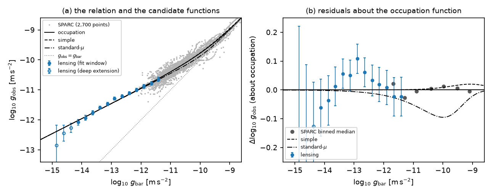
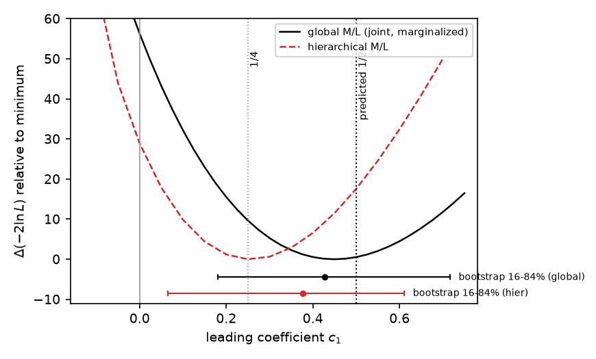
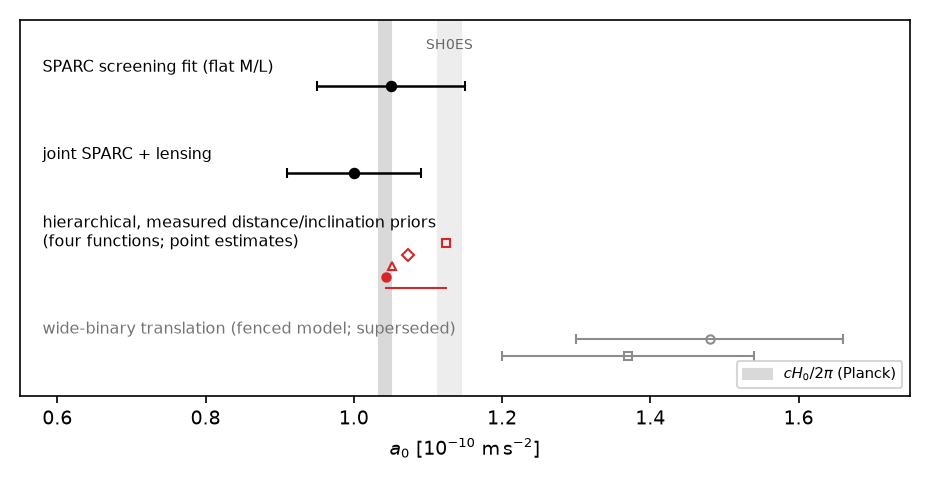
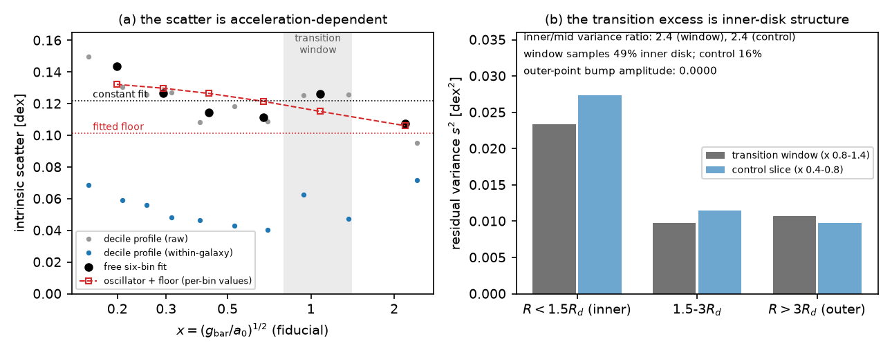
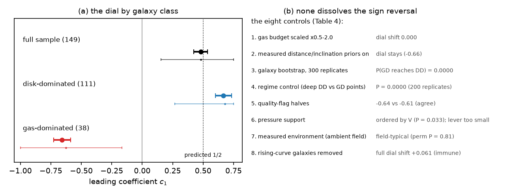

# Coefficient-level tests of the radial acceleration relation: a measured zero-point coefficient, an acceleration scale at cH₀/2π, and a gas-dominated anomaly

**Filip Hájek** (independent researcher) — hfilip11@gmail.com

*Draft 0.4 (2026-08-06), written from the program record (PAPER.md v4.0). All Round 15 referee items applied (methods subsection 2.2, the a₀-drift direction, the quarter-variant collapse phrasing, claim-grade qualifiers, sentence splits), plus the pre-circulation polish (abstract within the 250-word cap, final splits, cross-references). References verified (Desmond 2023 corrected to MNRAS 526, 3342 against its abstract). Figures 1–5 are produced by a provenance-gated build (calcs/paper2_figures.py). Not for circulation.*

*Acknowledgments: the computational analysis, literature verification, and manuscript drafting were performed in collaboration with Claude (Anthropic). The full chronological program record, including all logged corrections, is public in the repository (Appendix B). A companion paper analyzes the wide-binary regime of the same program.*

## Abstract

The interpolating function preferred by the radial acceleration relation (RAR), ν(y) = (1 − e^(−√y))⁻¹, was shown by Cadoni & Tuveri (2019) to be 1 + n(x), with n a Bose–Einstein occupation, x = √(g_bar/a₀), and a₀ = cH₀/2π derived rather than fitted. That identity fixes every coefficient of the function in advance, converting the choice of function from a convention into a sequence of measurements. We report coefficient-level tests on 2,700 SPARC rotation-curve points, weak-lensing RAR data, and published per-galaxy environmental fields. The leading low-acceleration coefficient is measured at c₁ = 0.26–0.45 across mass-to-light treatments (bootstrap 0.4 ± 0.3), with c₁ = 0 excluded in every treatment; the predicted value is ½. The screening index of the transition is p = 0.58 ± 0.12 under flat mass-to-light marginalization, consistent with the predicted ½, with hierarchical treatments preferring a somewhat sharper tail (p ≈ 0.65). Hierarchical fits with measured distance and inclination priors return a₀ = (1.04–1.13) × 10⁻¹⁰ m s⁻², on the horizon value cH₀/2π for every function tried. The relation's intrinsic scatter is acceleration-dependent; its transition excess traces to inner-disk astrophysics, and the fluctuation discriminator among bath readings is not measurable at SPARC depth. One anomaly is opened rather than closed: the 38 gas-dominated galaxies fit a leading coefficient of opposite sign to the 111 disk-dominated galaxies, a tension that survives eight controls and stands against every function in our ledger. We state the falsifiers: the second Bernoulli rung, the Gaia DR4 tests, and a₀ ∝ H(z).

## 1. Introduction

Rotation curves of disk galaxies obey a tight radial acceleration relation: the observed centripetal acceleration g_obs is a function of the Newtonian baryonic acceleration g_bar alone (McGaugh, Lelli & Schombert 2016; Lelli et al. 2017). The relation transitions from g_obs ≈ g_bar at high accelerations to g_obs ≈ √(g_bar a₀) below a₀ ≈ 1.2 × 10⁻¹⁰ m s⁻². The relation is usually summarized by an interpolating function ν(y), with y = g_bar/a₀, chosen by fit quality. Two choices dominate the literature: the "simple" function of Famaey & Binney (2005) and the exponential-screening function preferred by the RAR fits.

Cadoni & Tuveri (2019) derived the second function rather than fitting it: ν = 1 + n_BE(x), with x = √y and n_BE the Bose–Einstein occupation number, from thermal excitations of the de Sitter horizon, with a₀ = cH₀/2π emerging from the derivation. Whatever one thinks of the derivation, it has a sharp empirical consequence that had not been exploited: it fixes the function's entire coefficient structure in advance. Expanded at low acceleration, the function's leading correction carries coefficient c₁ = ½ exactly, and the higher coefficients follow the Bernoulli numbers. The choice between interpolating functions therefore stops being a convention and becomes a ladder of parameter-free predictions, each testable against data. A further exact statement sharpens the contest between the two standard functions: the classical self-consistent limit of the same thermal reading reproduces the simple function exactly, so the empirical contest between them is, in this reading, a quantum-versus-classical question about the putative bath. We use that only as framing; every test below is a measurement on the functions themselves.

This paper reports the coefficient program. We measure the leading coefficient c₁ on SPARC under progressively more conservative mass-to-light treatments (Section 3), and the screening index of the transition (Section 4). We assemble the acceleration-scale ladder across data sets and treatments (Section 5). We then characterize the relation's second moment, where a fluctuation-level discriminator was proposed and honestly closed as unmeasurable at current depth (Section 6). Section 7 summarizes the function ledger: thirteen candidate laws scored against every test in the program under a pre-registered freeze, together with a methods finding from the companion wide-binary analysis, namely that the binary regime currently carries no function discrimination at all. Section 8 reports the program's one open anomaly, a sign-reversed coefficient in gas-dominated galaxies that survives eight controls. Section 9 states the solar-system constraint that binds every field-formulation reading of the boost, and the formulation dependence that relaxes it. Section 10 collects the falsifiers.

The program behind this paper runs under a bar-locking discipline: verdict thresholds and kill conditions are committed to a public repository before each deciding computation. Nineteen corrections logged during the program are documented in the record; the ones relevant to this paper are summarized in Appendix A. Every number is produced by a named script (Appendix B).

## 2. Data and methods

### 2.1 Data sets

Three data sets carry the measurements (Table 1).

*Table 1. Data sets.*

| Data set | Content | Role |
|---|---|---|
| SPARC (Lelli, McGaugh & Schombert 2016) | 2,700 rotation-curve points, 149 galaxies after quality cuts (inclination > 30°, quality flag ≤ 2, velocity error < 10%) | the coefficient, index, scale, and scatter measurements |
| KiDS-1000 weak-lensing RAR (Brouwer et al. 2021; Mistele et al. 2024, two reductions) | stacked lensing profiles reaching two decades deeper in acceleration | the deep-limit anchor; rung-2 reach assessment |
| per-galaxy environmental fields (Chae et al. 2021, Table 3) | 94–109 matched external-field estimates | the environmental control on the deep trend |

Baryonic accelerations use fixed population disk and bulge mass-to-light ratios (0.5 and 0.7 at 3.6 μm) where marginalization is not stated, and the stated hierarchical treatments elsewhere. Distance and inclination uncertainties enter the hierarchical fits as measured per-galaxy priors from the SPARC tables. The gas-dominated versus disk-dominated split of Section 8 classifies a galaxy by whether gas dominates the baryonic acceleration at more than half its points (38 versus 111 galaxies).

### 2.2 Estimators, likelihood, and uncertainties

The coefficient measurements use a one-parameter estimator family connecting the two standard functions, ν_λ = (1 − λ) ν_std + λ ν_occ, where ν_std is the standard-μ inverse and ν_occ the occupation function. The family's low-acceleration expansion has leading coefficient c₁ = λ/2 exactly, verified numerically before use, so a fit of λ is a measurement of c₁. The screening index p of Section 4 generalizes the occupation function's transition tail in the same way, with the occupation form at p = ½.

The likelihood is Gaussian in log g_obs per rotation-curve point, with the measurement variance from the velocity errors plus a fitted intrinsic-scatter term (constant except where Section 6 frees it). Three mass-to-light treatments recur. The flat treatment marginalizes one global disk mass-to-light rescaling. The hierarchical treatment adds per-galaxy mass-to-light freedom under 0.1 dex priors. The treatment with measured priors additionally frees each galaxy's distance and inclination under the per-galaxy uncertainties of the SPARC tables (median effect 0.097 dex on the accelerations). Lensing points enter with their published statistical and interpolation errors plus one global 0.2 dex stellar-mass offset nuisance.

Three interval conventions appear. Profile intervals are Δ(−2 lnL) = 1 ranges over the profiled parameter. Galaxy bootstraps resample whole galaxies with replacement and are the conservative accounting wherever quoted; they are wider than the profiles because residuals within a rotation curve correlate strongly (Section 6.2). Where a statistical interval and a systematic term combine, the combination is quadrature and is stated. Every fit class passed an injection-recovery gate (known truth recovered without bias) and a nesting identity (the richer model reproduces the poorer at the shared boundary) before its numbers were quoted; the two gate failures that survived are reported as failures in Section 6.3 and Appendix A.

The continuous family above and the discrete function ledger of Section 7 are different objects. The family measures the leading coefficient; the ledger scores fixed candidate functions whole. The quarter-versus-half discussion touches both, and we flag which is meant at each use.

*Figure 1. The radial acceleration relation. (a) The 2,700 SPARC points (grey, fixed population mass-to-light ratios) with the stacked weak-lensing measurement of Mistele et al. (2024): filled circles inside the fiducial fit window, open circles the deep extension. Curves show the occupation, simple, and standard-μ functions at the fiducial a₀ = 1.2 × 10⁻¹⁰ m s⁻², with the line g_obs = g_bar dotted. (b) The same data as residuals about the occupation curve: SPARC binned medians (grey) and lensing points (blue), with the rival functions drawn as curves. A global 0.2 dex stellar-mass systematic applies to the lensing g_bar and is treated as a nuisance in the fits. The candidate functions separate by a few hundredths of a dex, which is why the coefficient tests of Section 3 run at the likelihood level.*

## 3. The zero-point coefficient

### 3.1 The branch test

The lowest rung distinguishes c₁ = ½ (shared by the occupation and simple functions) from c₁ = 0 (the standard-μ family, whose deep correction is exponentially suppressed). Under a raw chi-square likelihood the half branch is preferred in 198–200 of 200 galaxy-level bootstrap resamples. Marginalizing the relation's intrinsic scatter deflates this to a sign-robust strong lean: Δ(−2 lnL) = 56 with the half branch ahead in 166 of 200 resamples. We report both treatments. The raw statistic overstates the significance because it inherits the scatter mis-model; the deflation between the two treatments recurs throughout this program, and we quote the marginalized numbers as primary everywhere.

### 3.2 The coefficient measured

Promoted to a continuous parameter within the estimator family of Section 2.2, the coefficient is measured rather than contested (Table 2). The profile value under a global mass-to-light ratio is ĉ₁ = 0.45 (0.39–0.52); under hierarchical per-galaxy mass-to-light marginalization it is 0.26 (0.21–0.31). Injection tests recover unbiased values in both treatments, so the spread between them is real structure (the nuisance sensitivity of the estimator), not machinery bias. Galaxy bootstraps agree across treatments at approximately 0.4 ± 0.3.

*Table 2. The leading coefficient across treatments.*

| Treatment | ĉ₁ | c₁ = 0 excluded by | Note |
|---|---|---|---|
| global M/L, profile | 0.45 (0.39–0.52) | Δ(−2 lnL) = 56; 7.5σ profile / 95.5% of bootstraps | raw-χ² objective edge-runs on the same family and is not used |
| hierarchical M/L, profile | 0.26 (0.21–0.31) | excluded in every treatment | injection-gated; spread with the row above is nuisance structure |
| galaxy bootstrap (both) | ≈ 0.4 ± 0.3 | ≥ 89% of resamples | the conservative accounting |
| wide binaries (companion paper) | no constraint | — | the fenced-model indication 0.37–0.50 was erased under the landed posterior; the λ profile is flat |

Three statements survive every treatment. The coefficient is positive: c₁ = 0 is excluded in each row. The predicted ½ sits inside every bootstrap band. And the second digit, ¼ versus ½, is open on the galaxy side: the quarter value is disfavored at 3.1σ under the flat treatment, but the hierarchical profile peaks near it. The decomposition of Section 4 shows most of that hierarchical preference is a tail effect rather than a deep-coefficient vote.

The binary row deserves its negative statement. An earlier fenced-model fit of the companion paper's wide-binary likelihood returned a two-realization indication of c₁ = 0.37–0.50. Under the final marginalized model the profile over the coefficient family is flat within realization scatter. The binaries currently carry no constraint on c₁, and the coefficient dial is measured in one system, the galaxies.

*Figure 2. Profile likelihoods for the leading coefficient c₁ under the global (solid) and hierarchical (dashed) mass-to-light treatments, each relative to its own minimum. Vertical lines mark c₁ = 0, ¼, and the predicted ½. The horizontal bars show the galaxy-bootstrap 16–84% intervals with medians. Zero is excluded in both treatments, and the prediction sits inside both bootstrap bands.*

## 4. The screening index

The transition's sharpness is parameterized by a screening index p, with the occupation function at p = ½ in this convention. The flat-marginalized measurement is p = 0.578 (+0.121/−0.115), with the predicted ½ at 0.7σ. Solar-system consistency independently requires p > 0.234 (a Cassini-derived floor; the measured 16th percentile is 0.462), which the measurement clears comfortably.

Hierarchical treatments prefer a sharper tail. A converged hierarchical contest of the function matrix inverts its flat-treatment ordering, and the inversion decomposes: three quarters of it is a screening-tail preference, p ≈ 0.6–0.65 across treatments at Δ(−2 lnL) = 56 over the pure occupation tail, not a deep-coefficient vote. Adding the measured distance and inclination channel halves the surviving tail preference. The residual is real but modest, and it is the one place where the galaxy data pull against the occupation function's exact shape. We carry it as an open digit rather than absorbing it: the deep coefficient reads ½, the tail reads slightly sharper than ½, and no single fixed function in our ledger fits both preferences at full strength simultaneously.

## 5. The acceleration scale

The scale a₀ is the reading's temperature: the derivation ties it to the horizon, a₀ = cH₀/2π = 1.04 × 10⁻¹⁰ m s⁻² for the Planck H₀. Table 3 assembles the ladder.

*Table 3. The acceleration-scale ladder.*

| Measurement | a₀ (10⁻¹⁰ m s⁻²) | Pull against cH₀/2π |
|---|---|---|
| SPARC screening fit (flat M/L) | 1.05 ± 0.10 | +0.1σ |
| joint SPARC + lensing | 1.00 ± 0.09 | −0.5σ |
| hierarchical fits with measured distance/inclination priors | 1.04–1.13 (every function tried) | on the horizon value |
| wide binaries, translated through the external-field tables (companion paper) | 1.37–1.48 ± 0.18 under the fenced model | +1.9σ to +2.5σ; fence-conditional, superseded by the companion paper's upper limit |

The third row is the strongest statement. Before the distance and inclination channel was added, the hierarchical treatments drifted low, to (0.8–1.0) × 10⁻¹⁰, traded against high fitted mass-to-light ratios. With the measured priors in place, all four functions tried return to the horizon value. The drift was a nuisance effect, and the scale lock survives the most conservative treatment we can construct. The binary translation's high-side pull was carried openly as the sharpest internal tension while the fenced binary amplitude stood; with that amplitude now an upper limit (companion paper), the row is conditional history rather than a live pull.

*Figure 3. The acceleration-scale ladder (Table 3). Shaded bands mark cH₀/2π for the Planck and SH0ES values of H₀. The hierarchical row shows the four function point estimates under measured distance and inclination priors; the bracket spans their range. The wide-binary translation row (grey, open) is conditional on the fenced model superseded by the companion paper's upper limit.*

## 6. The second moment

### 6.1 The scatter is acceleration-dependent

The RAR's intrinsic scatter is not constant. Free-bin fits prefer acceleration dependence by Δ(−2 lnL) = 43 over a constant scatter at five parameters, falling from 0.144 dex in the deep regime toward 0.107 dex in the Newtonian regime under the flat treatment. A one-parameter oscillator-plus-floor shape captures the trend at Δ(−2 lnL) = 25. The trend survives disk mass-to-light marginalization, with the floor tightening to 0.059 dex. Under the full hierarchy with per-galaxy distance and inclination freedom, the floor converges to 0.035 dex, consistent with the 0.034 dex of Desmond (2023). At that depth the acceleration-dependent term is no longer identifiable, a boundary demonstrated by the treatment's own injection gate rather than assumed. An environmental rival for the deep trend was executed with the measured per-galaxy fields of Chae et al. (2021) and excluded at those amplitudes: the collinear maximum-clustering pattern is rejected at Δ(−2 lnL) = 168, and the fitted global amplitude is 0.04.

### 6.2 The transition bump is inner-disk astrophysics

A scatter excess near the transition (x ≈ 1) survives every marginalization tried. Its identification is astrophysical, not fundamental. At fixed acceleration the scatter is organized by disk radius: points inside 1.5 disk scale lengths carry about 2.4 times the variance of mid-disk points in both the transition window and the neighboring control slice, and the window happens to sample 49% inner-disk points against the control's 16%. On outer-disk points the bump's fitted amplitude is exactly zero. Beam smearing, bars, and spiral streaming at the documented 10–40 km s⁻¹ level are the natural driver class. Two methodological facts travel with this: adjacent RAR residuals within a rotation curve correlate at ρ ≈ 0.87, so per-point likelihood gaps in this field are nominally calibrated only; and the genuinely point-level scatter floor is 0.04–0.07 dex.

### 6.3 The fluctuation discriminator, closed honestly

Distinct bath readings predict distinct scatter statistics (an Einstein-fluctuation contest between occupation-like and wave-like variance). The instrument was built and gated. Its result: a shot-noise-like bath is excluded (it collapses onto the floor at Δ(−2 lnL) = 25), but the discriminating exponent is not measurable on SPARC at any grade tried. The transition bump of Section 6.2 occupies exactly the acceleration window where the readings differ most, and the calibrated injection gate fails on the informed designs. The prediction moves fully out of sample with both kill directions pre-registered in the program's prediction ledger; anchored-distance subsamples, integral-field kinematics with non-circular modeling, or Gaia DR4 depth would open it.

*Figure 4. The second moment. (a) Intrinsic scatter against acceleration: the free six-bin fit (filled black), the per-bin values of the one-parameter oscillator-plus-floor model (open red), the constant fit (dotted), and the decile profiles of the raw and within-galaxy (offset-subtracted) scatter. The shaded window marks the transition excess near x = 1. (b) The excess decomposed by disk radius at fixed acceleration: inner points carry about 2.4 times the variance of mid-disk points in both the transition window and the control slice, the window oversamples the inner disk (49% against 16%), and on outer points the fitted bump amplitude is zero.*

## 7. The function ledger

Thirteen candidate laws, spanning the standard families and the program's constructed variants, were scored against every test in the program: the galaxy likelihood under flat and hierarchical treatments, the screening index, the acceleration-scale ladder, the environmental control, the wide-binary likelihood of the companion paper, and the solar-system constraint of Section 9. Following an external methodological review, the function list is frozen: the in-sample search is closed at these thirteen, newly constructed forms enter as consistency rows only, and function-level claims route through a registered prediction ledger. Where this paper compares functions, the comparison is scoped to that closed list, and the search's multiplicity (roughly thirty forms examined across the program's history) is stated as uncorrectable rather than corrected.

The ledger's current state is quickly summarized. On the galaxy side, the hierarchical treatments are led by the occupation function's sharpened-tail variants, with the plain occupation function behind them and the simple function trailing further. The quarter-coefficient function's large apparent lead collapses once the distance and inclination channel is active, from about 76 to about 9 log-likelihood units ahead of the occupation function; its earlier outright rejection was a binary-side result under the fenced companion model and dissolves into the degeneracy described below. These are statements about fixed candidate functions, not about the continuous coefficient profile of Section 3, whose hierarchical peak near the quarter value Section 4 decomposes into a tail effect. No candidate resolves the Section 4 tension (deep ½ with a slightly sharper tail) at full strength in a single fixed form. On the binary side, the companion paper's landed model erases all discrimination: all thirteen laws (and three additional consistency rows) sit within ±8 log-likelihood of the occupation function, with seed scatter of the same size. Newton loses on every function-realization row by at least 7.9 at the full-sample anchor, though the companion paper's operative gravity statement remains the quality-stratified upper limit, under which the Newtonian amplitude is not excluded. We regard the degeneracy as a methods finding for the field. At present, wide binaries do not select among modified-dynamics interpolating functions, and rotation curves are the only function discriminator. Published claims that binary data prefer one function over another should be examined for the model conditions our own earlier indication turned out to carry. Outside the family, two brackets close the ledger: no standard-family function survives both the measured wide-binary window and its own published solar-system verdict, and the ΛCDM radial-acceleration attractor of current simulations does not print a zero-point digit at all, so the c₁ dial is, at present, a modified-dynamics observable.

## 8. The gas-dominated anomaly

A robustness control returned an anomaly instead. Measuring the coefficient on gas-dominated galaxies, where the stellar mass-to-light nuisance nearly vanishes, was intended as the clean confirmation; it returned a sign reversal. Under the treatment with measured distance and inclination priors, the 38 gas-dominated galaxies fit ĉ₁ ≈ −0.66 where the 111 disk-dominated galaxies fit +0.67. The full-sample headline of Section 3 is a disk-dominated compromise, and a negative c₁ is outside every function in the ledger, ours included.

Eight controls have failed to dissolve the tension (Table 4).

*Table 4. Controls on the gas-dominated dial tension.*

| Control | Result |
|---|---|
| gas budget (helium, molecular corrections) | immaterial to the split |
| measured distance/inclination channel | barely moves the gas-dominated dial |
| galaxy-level bootstrap (300 replicates) | never reaches the full dial from gas-dominated draws (0/300); correlation suspect cleared |
| regime versus composition | disk-dominated deep points never vote like gas-dominated ones (0/200): the split follows galaxy type, not acceleration |
| data-quality axis | quality-blind: both quality halves give the same dial, and the velocity-ordering replicates inside each |
| pressure support | strongly ordered by rotation speed (P = 0.033) but the lever is ~10× too small, and the proper radius-dependent correction moves the dial the wrong way |
| environment (measured per-galaxy fields) | gas-dominated neighborhoods are field-typical (permutation P = 0.81); no ordering on ambient within the class |
| rotation-curve convergence | converged galaxies alone reproduce the dial; rising-curve galaxies read less negative; the full-sample dial is rising-flag-immune (Δλ̂ = +0.061, inside noise) |

The tension reads as either genuine physics of slow gas-rich dwarfs or a systematic in a class none of these eight axes test. Resolved dwarf kinematics beyond SPARC are the clean arbiter. We enter it in the ledger as an open anomaly against every candidate law and make no attempt to absorb it.

*Figure 5. The gas-dominated anomaly. (a) The coefficient dial by galaxy class under measured distance and inclination priors: the profile point with its Δ(−2 lnL) = 1 interval (thick) and the galaxy-bootstrap 5–95% range (thin; the bootstrap runs on the same instrument without the distance channel, whose point estimates agree with the plotted ones to 0.01 in the family parameter). (b) The eight controls of Table 4 with their key numbers.*

## 9. The solar-system constraint

Any field-formulation modified-gravity reading of the low-acceleration boost predicts an anomalous solar quadrupole, sourced by the transition shell at r_M = √(GM_⊙/a₀) ≈ 7,000 AU. Feeding the galactic calibration through our own external-field solver (cross-validated at the 15% level against Blanchet & Novak 2011) gives Q₂ ≈ 3.9 × 10⁻²⁶ s⁻² at boost amplitude α = 1.15. Here α scales the low-acceleration velocity boost relative to the parameter-free galactic calibration, α = 1; the companion paper's translated values appear in Table 3. This exceeds the Cassini bound of Hees et al. (2014) by roughly a factor of four. This restates, with an independent solver and calibration, the tension reported by Desmond, Hees & Famaey (2024). Three properties make it structural rather than adjustable. It is amplitude-locked: sharpening the screening tail lowers the raw quadrupole but raises the amplitude the transition data demand, and the product is invariant across the entire function family (4.0–5.8 times the bound for every member). It is composition-locked. A direction-blind variant of the external-field coupling would spherize the transition shell and evade the bound by the shell theorem. The wide-binary data exclude that variant on shape, the strongest single-model exclusion in the program's contests, so the vector composition that sources the quadrupole is forced by the data. And it is formulation-dependent in exactly one direction. In trajectory formulations of modified inertia, where the boost attaches to the worldline's own acceleration history, Saturn's trajectory never samples the transition, and the observable sits hundreds of orders below the bound. The wide-binary data of the companion paper fit the trajectory formulation exactly as well as the field formulation. The constraint therefore does not falsify the measured function; it constrains its realization. Field-formulation readings of a full-calibration boost are in direct conflict with Cassini, while trajectory formulations are not. Independently, the companion paper's upper limit on the binary amplitude weakens the binary-calibrated version of the tension to below decisive strength.

## 10. Discussion and predictions

### 10.1 What is measured

Three numbers constitute this paper's positive claims. The leading coefficient of the RAR's low-acceleration expansion is positive and consistent with ½ (Section 3). The screening index is consistent with ½ at the transition, with a modestly sharper tail preference in hierarchical treatments (Section 4). The acceleration scale equals the horizon value under the most conservative treatment, for every function tried (Section 5). Each is a measurement of the relation, independent of any mechanism; the identity that motivated them fixes their predicted values, and the data land on two of the three exactly, with the third (the tail digit) genuinely open.

### 10.2 What is honestly open or closed

The fluctuation discriminator is closed at SPARC depth (Section 6.3). The transition-region scatter excess is identified with inner-disk astrophysics (Section 6.2). The function contest above the leading coefficient is open: the quarter-versus-half second digit, and the tail's sharpness, await deeper data. The gas-dominated anomaly is open against every candidate (Section 8). And the wide-binary regime, per the companion paper, is currently a null instrument for function selection.

### 10.3 Falsifiers

1. The second Bernoulli rung (c₂ = 1/12 against 1/8) decides the quantum-versus-classical bath framing. Present reach is 0.1σ; the requirement is lensing stellar-mass cross-calibration at the 0.02 dex level, or Gaia DR4 distribution-level tests.
2. a₀ ∝ H(z): the horizon reading ties the acceleration scale to the epoch. High-redshift rotation curves at JWST/ALMA depth test whether a₀ tracks H; present high-z kinematics are dispersion-dominated and cannot yet decide.
3. The gas-dominated anomaly resolves with resolved dwarf kinematics beyond SPARC: either the negative dial survives independent data, making it physics, or it identifies an untested systematic class in rotation-curve construction for slow gas-rich systems.
4. The solar-system constraint sharpens with the formulation: any construction of the boost must either suppress the field-formulation quadrupole by the measured factor of four or realize the trajectory formulation; Gaia DR4 eccentricity resolution separates the two on the binaries directly.
5. The program's registered prediction ledger carries the out-of-sample function tests (environmental tail dependence; redshift running); in-sample function claims beyond the frozen thirteen are out of scope by construction.

### 10.4 Credence

The program attaches explicit credences to its readings and updates them only through maps committed before deciding computations. For this paper's content: the coefficient, index, and scale measurements are claimed at their stated statistical grades and are mechanism-independent. The thermal reading that motivated them is treated as a hypothesis under test; its distinguishing predictions are either confirmed at leading order (c₁, a₀), open (the second digit, the tail), or out of sample (the falsifier list). We do not attach a probability to the reading itself in this paper; the companion paper states the program's credence for the wide-binary anomaly (approximately 53%), and the record states the full credence ledger.

## 11. Conclusions

The radial acceleration relation's interpolating function has a measured coefficient structure. The leading low-acceleration coefficient is c₁ = 0.26–0.45 across treatments with zero excluded everywhere; the predicted half sits inside every bootstrap band. The screening index is consistent with one half. The acceleration scale, under hierarchical fits with measured distance and inclination priors, is the horizon value cH₀/2π for every function tried. The relation's intrinsic scatter is acceleration-dependent with its transition excess traced to inner-disk astrophysics, and the fluctuation-level discriminator among bath readings is closed at current depth. The wide binaries of the companion paper currently discriminate among none of the candidate functions. One anomaly stands open: gas-dominated galaxies fit a sign-reversed coefficient through eight controls. The solar-system quadrupole binds field-formulation readings at four times the Cassini bound, amplitude- and composition-locked, while trajectory formulations pass it by construction and fit the binaries equally well. The decisive next data are named: 0.02 dex lensing calibration or DR4 for the second rung, resolved dwarf kinematics for the anomaly, and high-redshift rotation curves for a₀(z).

## Appendix A: transparency

The program logged nineteen corrections; those relevant to this paper:

- The occupation identity, its horizon derivation, and a₀ = cH₀/2π were initially claimed as apparently novel. A primary-source read of Cadoni & Tuveri (2019) showed all three published there; every such claim was retracted, and this paper is framed as the framework's test.
- The 198–200/200 branch verdict and an apparent within-branch function lean were shown to be likelihood-model dependent; the scatter-marginalized treatment deflates the former to a robust lean and dissolves the latter.
- The superthermal wide-binary eccentricity distribution, quoted in an early notebook claim of novelty, was published by Hwang, Ting & Zakamska (2022); the claim was retracted and converted into the companion paper's cross-validation.
- Two instrument-level honest failures are recorded rather than repaired: the calibrated injection gate of the full-hierarchy scatter treatment fails on the informed designs (Section 6.3 is closed, not decided), and a template contest for the transition bump was self-disqualified by its own injection gate before the inner-disk identification settled the question.

The complete list, including the corrections specific to the wide-binary analysis, is in the program record.

## Appendix B: reproducibility

Every quantitative claim maps to a named script and output in the public repository (github.com/TheCake/thermal-horizon-rar), alongside the chronological program record (PAPER.md, the long-form companion to both papers), the audited measurement ledger (LEDGER.csv), and the SHA256 data manifest. Key mappings (all under calcs/):

- the screening index: sparc_rar_fit.py, stage4h_p_ml.py
- the branch and rung tests: stage4a through stage4f
- the coefficient measurement: stage4s_c1fit.py (hierarchical: stage4z_hierc1.py)
- the second moment and its controls: stage4t_bathnoise.py, stage4u_mlnoise.py, stage4w_fullhier.py, stage5a_bumptemplate.py, stage7a_einstein.py, stage7b_bumphunt.py, stage7c_gammaclean.py
- the environmental control: stage5b_envtest.py, stage5e_envtest_conv.py (Chae et al. 2021 Table 3 extracted to data/chae2021_table3.csv)
- the hierarchical function contest and tail decomposition: stage5c_hierbath.py, stage5d_hierbath_conv.py, stage5g_tailtest.py, stage5m_hierv.py
- the acceleration-scale ladder: stage5l_ladder.py, stage4v_scorecard.py
- the function ledger and world table: stage6q_worldtable.py (LEDGER.csv rules in LEDGER.md)
- the gas-dominated anomaly and its eight controls: stage8s_gasc1.py, stage8sb_gasedge.py, stage8sc_gddist.py, stage8v_gdboot.py, stage8x_regime.py, stage8y_pressure.py, stage9b_qflag.py, stage9c_adcorr.py, stage9g_gdambient.py, stage9m_convsplit.py, stage9n_risingdial.py
- the quadrupole and its locks: stage4k_quadrupole.py, stage5i_quadrupole2.py, stage5s_betaquad.py, stage6w_scalarefe.py; the trajectory formulation: stage7g_trajsaturn.py, stage7h_miavg.py; the inertia-versus-gravity brackets: stage4l_mi_runner.py
- the binary function degeneracy (companion paper): stage7jd_read.py
- the figures: paper2_figures.py (gated; regresses every plotted number against the committed stage outputs, provenance dump in data/paper2_figs.txt)

Large datasets are re-fetched by documented URLs: SPARC via Zenodo, the KiDS reductions via the survey portal and arXiv source.

Data availability: all derived data products, stage outputs, scripts, the audited measurement ledger, and the SHA256 data manifest are public in the repository; the large source catalogs are re-fetched by the documented URLs above.

## References

(Inherited from the program's 2026-07 INSPIRE-verified list.)

- Blanchet, L., & Novak, J. 2011, MNRAS 412, 2530
- Brouwer, M. M., et al. 2021, A&A 650, A113
- Cadoni, M., & Tuveri, M. 2019, PRD 100, 024029
- Chae, K.-H., Desmond, H., Lelli, F., McGaugh, S. S., & Schombert, J. M. 2021, ApJ 921, 104
- Desmond, H. 2023, MNRAS 526, 3342
- Desmond, H., Hees, A., & Famaey, B. 2024, MNRAS (arXiv:2401.04796)
- Famaey, B., & Binney, J. 2005, MNRAS 363, 603
- Hees, A., Folkner, W. M., Jacobson, R. A., & Park, R. S. 2014, PRD 89, 102002
- Hwang, H.-C., Ting, Y.-S., & Zakamska, N. L. 2022, MNRAS 512, 3383
- Lelli, F., McGaugh, S. S., & Schombert, J. M. 2016, AJ 152, 157
- Lelli, F., McGaugh, S. S., Schombert, J. M., & Pawlowski, M. S. 2017, ApJ 836, 152
- McGaugh, S. S., Lelli, F., & Schombert, J. M. 2016, PRL 117, 201101
- Milgrom, M. 1983, ApJ 270, 365
- Milgrom, M. 2010, MNRAS 403, 886
- Milgrom, M. 2011, Acta Phys. Pol. B 42, 2175; 2023 (arXiv:2310.14334)
- Mistele, T., McGaugh, S., Lelli, F., Schombert, J., & Li, P. 2024, JCAP 04, 020
- Petersen, J., & Lelli, F. 2020, A&A 636, A56
