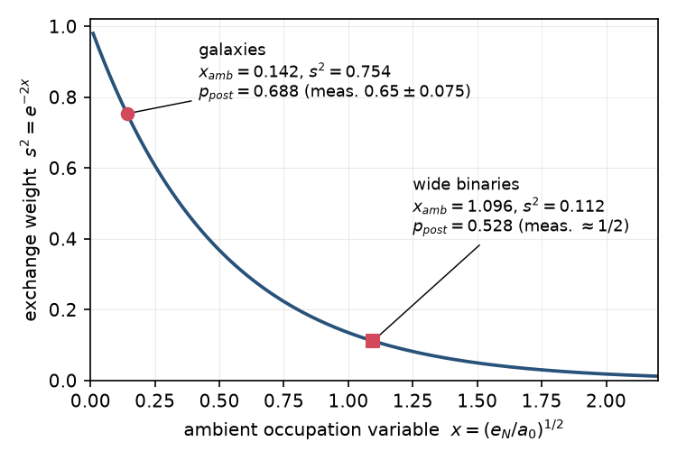
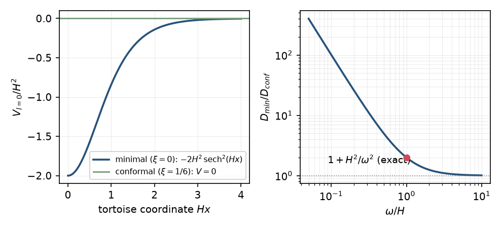
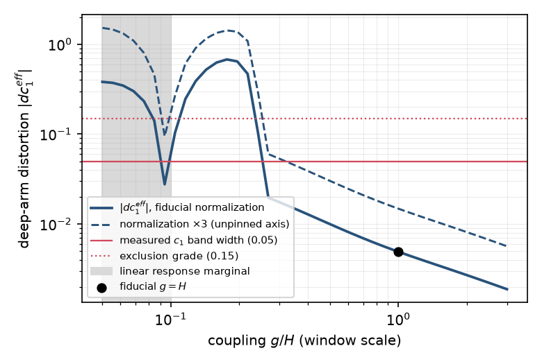
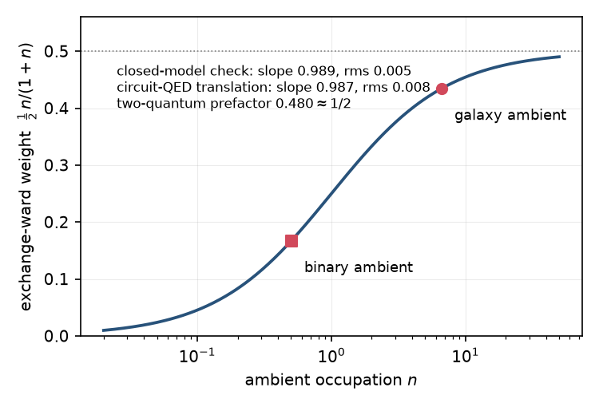

# A horizon-thermal mechanism for the radial acceleration relation: exact results and open constants

**Filip Hájek** (independent researcher) — hfilip11@gmail.com

*Draft 0.5 (2026-08-10). Draft 0.2 absorbed the coupling-derivation arc (the carrier exclusions and selection rule, the linearity theorem and the direct coefficient fit, and the pre-registered exclusion of the real-exchange realization). Draft 0.3 applied the paper's first referee round (an independent AI referee session; sixteen findings adopted, none a computed error). Draft 0.4 absorbed the post-review derivation results: the exact spectral characterization of the natural coefficient and its threshold family, the negative closure of the occupation-self-consistency route, the meter-convention pin that makes the two-meter tension physical, and the redshift-lock external comparison at z of order one. This draft applies the second referee round (same protocol; verdict minor revision, no computed error among 49 re-checked quantities; one attribution fix and six polish items adopted). Written from the program record (PAPER.md v4.0 and the post-v4.0 ledger through the derivation stages); companion papers: Hájek 2026a (wide binaries) and 2026b (coefficients). Figures 1–4 are produced by calcs/paper3_figures.py under provenance gates (data/paper3_figs.txt). References inherit the program's verified lists; the three entries new to this paper's first drafts (Gibbons & Hawking 1977; Jaynes & Cummings 1963; Pöschl & Teller 1933) are standard classics, and Ciocan et al. 2026 was verified by primary read of both the paper and its public data release. Not for circulation.*

*Acknowledgments: the computational analysis, the adversarial review rounds, and the manuscript drafting were performed in collaboration with Claude (Anthropic). The adversarial reviews cited throughout, including those that downgraded two soft-sector verdicts adopted in the text, were run as independent AI referee sessions: separate large-language-model instances briefed fresh each round with no memory of the program, which reproduced every load-bearing number before any ruling was adopted. They are not human peer review, and this draft has not yet been refereed by humans. The full chronological record, including all logged corrections and the pre-registration commit chain, is public in the repository (Appendix B).*

## Abstract

Companion papers measure the radial acceleration relation at coefficient level and bound the wide-binary velocity boost. We ask whether a thermal-horizon mechanism can carry them, and what would kill it. We work in the Cadoni–Tuveri (2019) framework: the interpolating function is a Bose–Einstein occupation at the de Sitter temperature. Five results follow. First, reduction theorems: a many-mode ambient reduces exactly to one collective mode, and stable circular orbits in Schwarzschild–de Sitter satisfy Ω/H₀ > 1.449, licensing a frozen bath. Second, the soft sector is solvable: the static-patch radial problem is the Pöschl–Teller well, an infrared gap is required, and the gapped leak is four orders below the smallest measured exchange weight. Third, a selection rule and a linearity theorem: in an exterior monopole potential the horizon coupling commutes with the system number operator, so any surviving carrier acts dispersively, and its frequency pull, linear in occupation, selects the additive law over its multiplicative rival. The coefficient is measured at 1.0 to 1.5, with a single value rejected; its natural value is an exact two-level degeneracy of the dressed spectrum; a self-consistency route to bounding it closes negative; and the tension between its two meters is physical, not notational. Fourth, the real-exchange realization of the environmental gate fails a pre-registered participation ceiling by factors 6.7 to 9.2 at its own fluctuation-dissipation budget; the pre-committed penalty was executed. Fifth, the exchange law remains exact in closed models and testable in circuit QED. Our conditional credence in the mechanism is about 8%.

## 1. Introduction

The companion papers of this series establish two empirical anchors. On galaxies, the radial acceleration relation (McGaugh, Lelli & Schombert 2016) is measured at coefficient level: the deep-side expansion of the interpolating function carries a nonzero next-to-leading coefficient, in a band (0.26 to 0.45) consistent with one half and with the quarter-versus-half digit open, the acceleration scale locks onto cH₀/2π under hierarchical treatment, and the Newtonian-side screening is exponential (Hájek 2026b). On wide binaries, the corresponding velocity boost is bounded from above at half the galactic calibration on the cleanest strata, with a small allowed sector remaining and Newton not excluded (Hájek 2026a).

Those papers are deliberately phenomenological. This note is the mechanism companion, and its scope is stated at the outset. We do not claim a derivation of low-acceleration dynamics (Milgrom 1983). We ask whether a specific microphysical reading, gravitational dressing by the thermal soft sector of the de Sitter horizon, is internally consistent with the measured numbers, which parts of it can be established at theorem grade, which parts fail, and which single quantities now carry the burden. Since the first draft of this note, the coupling-derivation program ran to completion. Its positive half fixes the form of the surviving coupling by a selection rule and a linearity theorem (Section 6); its negative half excludes the real-exchange realization of the environmental gate at the derived coupling (Section 7). Both halves are reported in full, the exclusion with its own section and its credence cost stated. The reading follows Cadoni & Tuveri (2019), who derived the observed interpolating function as a Bose–Einstein occupation law of thermally excited horizon degrees of freedom, with the acceleration scale a₀ = cH₀/2π emerging rather than being fitted. Famaey & Durakovic (2025) note that no clear derivation of the interpolating function otherwise exists in the literature; the Cadoni–Tuveri identity is, in our assessment, the strongest available candidate, and the program of this series treats it as a hypothesis to be tested rather than adopted.

Our method is the same discipline as in the companion papers: verdict thresholds are committed to the public repository before each deciding computation runs, and failed conclusions are retracted in the open. Adversarial review rounds were run against the load-bearing calculations by independent AI referee sessions (see the acknowledgments for their nature), whose numerical reproductions and two verdict downgrades are adopted here. Every number in this paper is produced by a named script (Appendix B).

## 2. Measured targets and the dictionary

The identity at the center of the framework is algebraic. With y = g_bar/a₀ and x = √y, the interpolating function preferred by the rotation-curve data satisfies

  ν(y) = 1/(1 − e^(−x)) = 1 + n_BE(x),  n_BE(x) = 1/(e^x − 1).

Reading x as a ratio of frequency to temperature fixes the dictionary: a system whose Newtonian field is g_N carries a characteristic mode frequency ω = √(g_N a₀)/c, the horizon temperature in the same units is T = a₀/c = H/2π, and x = ω/T. Deep systems are soft (ω below T), Newtonian-regime systems are hard, and the occupations implied are large exactly where the anomaly lives. This dictionary is not decoration; every quantitative statement below is made in it.

The mechanism must then carry, at minimum, the following measured facts from the companion papers and the program record. The deep-side coefficient band c₁ ≈ 0.26–0.45 with the one-half branch preferred in direct contests. The tail exponents of the screening, p ≈ 0.65 ± 0.075 on galaxies and p ≈ 1/2 on binaries. The two-system split itself: galaxies and binaries prefer measurably different effective functions, and the difference survives every local-field control, pointing at the ambient environment as the discriminating variable. The exchange-weight reading compresses this split into one curve. Suppose the ambient sector at occupation n couples through its Boltzmann ratio s = n/(1+n) = e^(−x_amb), where x_amb is the ambient environment's own dictionary variable (fields from Chae et al. 2021), and the observable weight is the probability of supplying two quanta, s². Then the measured galaxy and binary values sit on one exponential at their measured ambient fields (Figure 1). This weight postdicts both tail exponents through p = 1/2 + s²/4: 0.688 and 0.528, against the measured 0.65 ± 0.075 and ≈ 1/2. These postdictions were obtained before the tail measurements existed at their current precision and are the strongest single reason to take the exchange reading seriously. Section 7 reports the outcome of the program's attempt to realize this weight microphysically; the weight itself is a measured regularity either way.

Since several related weights appear in this paper, we fix the accounting here. One relation organizes all of them: the tail exponent obeys p = 1/2 + r·s²/2, with s² the per-system gate above (Figure 1) and r a global amplitude whose ceiling is one half, set by equal-time sharing at resonance; the lending law of Section 7 (Figure 4), (1/2)·s, is the dynamical law that would realize that ceiling one quantum at a time. The postdictions just quoted are the r = 1/2 slice, a prediction rather than a fit; the direct fit of Section 8 gives r̂ = 0.34 ± 0.19, which contains 1/2 at 0.9σ and would move the galaxy value from 0.688 to 0.628, both inside the measured band. Three related constants therefore appear and are distinct objects: the resonant lending prefactor of one half, the amplitude ceiling r = 1/2 (exact under a purely dispersive carrier, Section 9), and the tail ceiling p ≤ 3/4, which is the r = 1/2, s² → 1 corner of the same relation.

*Figure 1. The exchange weight s² = e^(−2x_amb) against the ambient occupation variable. The two points are the measured ambient occupations placed on the model curve, not independent measurements of the weight; the annotations give the tail-exponent postdictions p = 1/2 + s²/4 against the measured values.*

## 3. Reduction theorems

Three structural results hold at theorem grade within the model class and set the terms for everything else.

### 3.1 One collective mode

For linear coupling of the system mode a to K ambient modes b_k through a single port, H_int = Σ_k λ_k(a†b_k + b_k†a), the interaction is exactly H_int = λ̄(a†A + A†a). Here A = Σ_k c_k b_k, with c_k = λ_k/λ̄ and λ̄² = Σ_k λ_k². The orthogonal (dark) combinations decouple from the dynamics, including in the presence of the system's Kerr nonlinearity (a frequency that shifts with its own occupation), and the bright-mode marginal of independent thermal modes is exactly thermal at the weighted occupation. Consequently the two-quantum exchange weight keeps the form s̄^L for the collective mode: the counting statistics of a many-mode thermal ambient are indistinguishable from one effective mode. The theorem is defensive: it does not produce the mechanism, but it closes the objection that a realistic multimode environment would replace the measured geometric statistics with a many-mode alternative. The data independently reject the leading such alternative (a which-path-distinguishable, number-additive gating produces the many-mode counting distribution, a negative-binomial tail, which saturates at 0.95 where 0.754 is measured).

### 3.2 Stable circular orbits see a frozen bath

In Schwarzschild–de Sitter spacetime the orbital angular frequency of a circular geodesic is exactly Ω_orb² = GM/r³ − Λc²/3, and the radial epicyclic frequency is κ_r² = GM/r³ − (4/3)Λc² to leading order in GM/rc² (the neglected relativistic terms are of relative order v²/c², below 10⁻⁶ for every measured system). Orbital stability (κ_r² > 0) therefore forces Ω_orb² > Λc² at the same order. Inserting the measured cosmological constant, Λ = 3Ω_Λ H₀²/c², gives Ω_orb > √(3Ω_Λ)·H₀ ≈ 1.449 H₀ at Ω_Λ = 0.7; in pure de Sitter units the same bound reads Ω_orb > √3·H_Λ, and it is saturated at the outermost stable circular orbit (GM/r³ = 4H_Λ²). The stable-orbit region thus terminates before the orbital and cosmological rates become comparable. The measured systems sit far inside: the slowest SPARC orbits have Ω_orb/H₀ ≈ 30, and the wide-binary sample sits near 5 × 10³. On the mechanism side this licenses the quenched treatment used throughout, in which the horizon sector is frozen on orbital timescales and exchanges quanta rather than acting as a Markovian damping bath. The corollary for free fall is exact: a geodesic detector registers the pure horizon temperature with no acceleration supplement, which is the derivation-grade root of the binaries' sharp screening in this framework.

### 3.3 Detuning is unresolvable

The exchange reading requires near-resonant lending between the system mode and the collective ambient mode. Within the model class this cannot be spoiled by mistuning: all couplings are of order H, and no system in the sample has existed for longer than a Hubble time, so the accumulated phase from any detuning in the soft sector is bounded by roughly 0.16 radians. Under every extraction rule tested (coherent, decoherent, finite-time), a soft-sector detuning perturbs the exchange weight at or below the ten percent level. This closes the mistuning objection. It does not establish resonance as a positive mechanism; that distinction is maintained throughout.

## 4. The soft sector is solvable

The objection that survived longest is the leak: a continuum of soft horizon modes, each contributing a small off-resonant admixture that grows linearly with occupation, could swamp the resonant exchange weight. Closing or confirming this required the horizon-side mode density, not another toy model. It turns out the required problem is exactly solvable.

In the de Sitter static patch, with tortoise coordinate x defined by Hr = tanh(Hx), the l = 0 radial equation for a massless scalar has potential V = −2H² sech²(Hx) for minimal coupling and V = 0 for conformal coupling. The minimal case is the λ = 1 Pöschl–Teller well, whose regular solution is elementary, v(x) = tanh(Hx) cos(ωx) + (ω/H) sin(ωx). Flux normalization then gives the exact ratio of near-origin coupling densities,

  D_min(ω)/D_conf(ω) = 1 + H²/ω²,

which localizes the de Sitter infrared enhancement in closed form (Figure 2). Transverse-traceless gravitational perturbations obey the minimally coupled equation, so the enhanced case is the graviton-like one. An independent referee session re-derived the potential from the metric (including the curvature coupling, R = 12H²) and reproduced the ratio exactly.

*Figure 2. Left: the l = 0 static-patch potentials; the minimally coupled (graviton-like) case is the reflectionless Pöschl–Teller well. Right: the exact infrared enhancement of the coupling density.*

Three consequences follow.

First, a necessity theorem. The thermally weighted continuum admixture for the graviton-like sector diverges linearly in the infrared (the integrand approaches [1/(8π³Ω²)]/ω² exactly), while the conformal sector converges. An infrared gap is therefore required, not optional, for the enhanced sector. The gap the data had already selected, in which each system's ambient environment lifts the deepest modes into a collective mode at the ambient dressing frequency, is thereby promoted from an interpretive reading to a structural requirement. We emphasize the asymmetry of this result: the geometry does not merely tolerate the gap, it demands one, and the ambient gap is the candidate the data independently prefer. Gap sufficiency is a separate question and is not established; at the physical coupling the safety margin is carried by the resonant window rather than the gap itself.

Second, with the gap at the measured ambient frequencies, the leak is bounded. At the physical coupling scale g ≈ H, the continuum admixture is 1.6 × 10⁻⁵ (binaries) and 3.8 × 10⁻⁵ (galaxies), four orders of magnitude below the smallest measured exchange weight (0.112), and it preserves the measured two-system ratio to a part in 10⁴. The small-coupling corner of the scan, where the admixture formally approaches the exchange weight, lies where the linear-response formula itself fails (per-mode admixtures of order ten) and is excluded from any claim in either direction.

Third, locality. Three angular sectors appear in this argument and we signpost them: the computed channel is l = 0; the leading neglected channel is l = 1; the physical graviton channel is l = 2. Near the origin the l-th partial wave couples as (ωR/c)^l, so the l = 1 channel enters with weights of 10⁻²⁴ (binaries) and 10⁻¹⁵ (galaxies) at the measured scales, and the thermal population of all gapped angular channels together contributes at the 4 × 10⁻⁴ level. The single-channel structure of the mechanism is therefore derived rather than assumed, for field-value coupling. Since spin-2 perturbations begin at l = 2, the computed l = 0 channel is a conservative proxy, and careful multipole accounting (the standard long-wavelength law: the 2^l-pole moment against the ω^l field gradient) confirms the physical graviton channel is more suppressed than the proxy, not less. The infrared enhancement itself appears to generalize across angular channels as an exact finite product, E_l = ∏ (1 + k²H²/ω²) over k ∈ {1, …, l+1} excluding l; the l = 1 member is proven and a predicted l = 4 member was locked numerically to 7 × 10⁻¹², but the general form is carried at conjecture grade. The caveat the locality result leaves is the normalization question of Section 5.

## 5. The dispersive budget and the two open axes

The same continuum exerts a dispersive pull on every system's frequency. Computed exactly at fiducial coupling, the pull has the closed form Δ = −(g²/4π²)·ln(1 + Ω/g)/Ω, where here and below Ω denotes the ambient gap frequency (the orbital frequency of Section 3.2 is written Ω_orb), and is, to within one part in 10³, a pure vacuum effect: a common-mode de Sitter Lamb shift of about −0.02 H, nearly identical for galaxies and binaries. Taken literally it is excluded by the data themselves (it would shift the deep relation catastrophically), so it must renormalize; the honest question is what remains after renormalization.

We declare the scheme rather than assume it. Exactly two universal transformations are absorbable: one additive constant in the bare frequency (the grammar is formulated in dressed frequencies; a constant pull with no system dependence redefines the unobservable zero point) and one multiplicative rescale of x, which is algebraically an a₀ recalibration. Together these are the affine transformations of x, and nothing beyond affine is absorbable. After removing the fitted affine part, the residual is propagated exactly through the occupation function and compared to the measured coefficient band.

The result is two-sided and we state both sides. At the fiducial point the residual is inside every measured band. The deep-arm distortion is 0.005 as a window mean and 0.023 at the most amplified deep end, against a measured coefficient band of width 0.05. The implied binary exchange-weight distortion is 4 × 10⁻⁴ against a 25% measurement precision. The absorbed rescale spends 2.1% of the acceleration-scale calibration, or 0.22σ of the measured a₀ band, a price the temperature lock can afford. The referee session verified, additionally, that the result is independent of the ambient anchor at fiducial coupling (identical for every tested gap frequency).

Against this, the margin is order unity, not comfortable, and it is controlled by two quantities (Figure 3). The first is the coupling scale: the budget is comfortable for g ≳ 0.3H and degrades below, though the degraded region is also where linear response fails. The second is the absolute normalization of the horizon coupling density: the residual scales linearly with it, and a factor-three normalization at g = 0.3H would cross the measured band. When the first draft of this note was written, the joint corner of these two axes sat past the exclusion grade (a deep-arm distortion of 0.15, three times the measured band; the upper line in Figure 3) and was the sharpest threat the framework carried. The carrier accounting of Section 6 has since dissolved that corner: the free radiative continuum, the one carrier that could have realized the dangerous normalization, is excluded by tens of orders of magnitude, and the surviving carrier class acts through the near-field constraint sector, whose action the same accounting fixes but whose absolute value it does not yet derive. The normalization question therefore remains open, but its worst corner is closed, and Section 6 states what the constant must now be measured against.

*Figure 3. The deep-arm ladder distortion after the declared renormalization, as a function of coupling. Solid: fiducial normalization; dashed: normalization times three (the unpinned axis). The horizontal lines mark the measured coefficient band width and the exclusion grade; the shaded strip marks where linear response becomes marginal.*

## 6. The carrier: exclusions, a selection rule, and the linear pull

The dispersive budget left one constant unpinned, the absolute strength with which a bound system couples to the horizon's soft spectrum. The derivation program addressed it by elimination first and by structure second.

The thermodynamic anchor is exact. In Schwarzschild–de Sitter spacetime the first law on the cosmological horizon, dM = −T_c dS_c, holds to all orders in the mass, so the energy bookkeeping between a bound system and the horizon sector is fixed by geometry rather than modeled. Against that anchor, the free radiative graviton continuum is excluded as the carrier of the coupling by 34 to 44 orders of magnitude: the wave energy a bound system actually exchanges with the far field falls short of the required coupling for any assignment of the lever arm, with dimensionless shortfalls of 7 × 10⁻⁴⁵ at the binary anchor and 1.2 × 10⁻³⁴ at the galaxy anchor. A confinement variant closes the remaining escape at five to eleven orders. This exclusion is what dissolves the pessimal corner of Section 5. The constant is thereby displaced, not discharged: it must reside in the near-field (constraint) sector, which is named but not derived.

The same elimination was then run over every candidate we could construct that trades real quanta with the system. Seven carrier families fail on rate, scale, or sign. The momentum-constraint loophole, a coupling that is off-diagonal in the system number operator in principle, is dead as a carrier by at least fifteen orders. The one matter-kinematic family with a rate in the soft band, apsidal precession of the widest orbits, implies an acceleration scale twelve orders wrong. The ambient cloud's own internal continuum contributes at the 10⁻⁸⁴ g² level. What survives is a theorem. For a bound system whose exterior potential is monopole, the interior coupling is a uniform potential shift, H_int = (Ĥ/c²) δΦ, which commutes with the system's number operator. No quanta are exchanged. Any carrier consistent with the exclusions acts dispersively: it shifts frequencies without trading energy.

The dispersive vertex then yields the paper's sharpest positive result. The polaron (displaced-frame) transformation at this vertex is exact, the bath occupation cancels between the two time-orderings, and the frequency pull reads the system's own local occupation linearly, at all orders: Δω = −(g²/Ω)(2n + 1 + 2σ), with n the local occupation and σ the anomalous (squeezing) part. Fed back through the dictionary of Section 2, a pull that enters the dressed frequency additively and linearly in occupation produces the additive occupation law, ν = 1 + n_BE; the multiplicative composition of the same pull diverges at finite argument (x = ln 2, squarely inside the measured regime) and is excluded. Within this reading, then, the form of the law stops being a free choice among interpolating functions: the vertex surviving our exclusions produces the additive form, with one coefficient left free and with regime structure in that coefficient still unexplained. The claim is conditional on the carrier accounting above, not framework-independent, and the coefficients remain Cadoni and Tuveri's series.

The selection comes with one coefficient, κ = 4g²/(Ωω), with Ω the ambient gap frequency and ω the system mode frequency, and the data constrain it from two directions. The acceleration-scale lock gives κ = 1.00 ± 0.05. The hierarchical galaxy tail prefers κ near 1.5; it excludes 1 at point grade while the bootstrap band 0.6 to 1.8 contains it. A first direct fit of the κ family sharpens the same tension: a single κ across regimes is rejected in both likelihood treatments (by 21.7 and 14.4 log-likelihood units, against a split null that never approaches the bar), with the forced single-κ fit at 1.50 (bootstrap 1.32 to 1.67, estimator bias assessed near +0.06). The split fit's own two values are not quoted because their running direction does not survive a change of likelihood treatment. The fit rides a documented ridge with the acceleration scale, so the rejection re-scopes the natural value rather than killing it: κ = 1 remains the target in the deep limit. The target also has an exact spectral meaning. Because the vertex couples the system's Hamiltonian, the zero-point energy gravitates, and the zero-point weight in the dressed ladder is one half by construction rather than by convention. The ladder then folds at a family of thresholds κ = 2/(n + 1): the spacing above level n closes at 2, 1, 2/3, and so on, and κ = 1 is exactly the degeneracy of the first and second excited levels, E(2) = E(1). At the natural value the second quantum of the dressed mode becomes free. The same statement appears as a pole: the static susceptibility of the one-quantum dressed state diverges as κ approaches 1 from below, with exact residue 4e^(−d²)/ω in the displacement d, verified numerically at the 0.003% level. The divergence survives a thermal ambient. Two further identities tie the value down. At κ = 1 the coupling energy is the geometric mean of the two zero-point energies, g² = E_zp,s·E_zp,b, equivalent to the two-quantum dressing energy E_c = 2ħω (the intermediate relation is the required dressing amplitude ½√(Ω/ω), derived in the scripts of the corresponding Appendix B row). And under the collective-mode reduction of Section 3.1 the coefficient is exactly invariant in the mode count, κ = 4λ̄²/(Ωω). A derivation of κ = 1 that does not first pin the absolute normalization therefore exists if and only if some structural principle ties the collective coupling λ̄² to Ωω/4; none is established. We flag deliberately what does not follow: no bound on the coefficient comes from the spectrum itself. The threshold family moves with the level count (the three-level analogue of the same ordering condition sits at 2/3, below the measured value), so the proximity of the measured lock value to the n = 1 threshold is a consistency observation at a chosen truncation; adversarial review showed the truncation choice was outcome-determining, and no bound is claimed. The degeneracy does carry a qualitative signature, an anomalously soft static response of deep systems near the natural value, which is unquantified and not registered as a prediction.

One route to promoting the threshold to a genuine bound was proposed in review and has since been closed. If the occupation feeding the pull were itself required to be self-consistent on the softened spacing, one could ask where such feedback first fails and whether the failure edge is κ = 1. It is not. The fed-back occupation has no fixed point at sky occupations at all: the existence ceiling lies between 0.015 and 0.14 across the deep window, a factor of 6.6 to 62 below the measured value. At the measured value the first fixed point appears only in the Newtonian regime, where nothing needs explaining. Equilibrium variants truncated at the ladder's fold cap the interpolating function at 1.93 against a measured demand of 19 at the deep anchor. The closure is stable across four spacing offsets and two truncation conventions, and it falsifies the self-consistency criterion rather than the framework: were the criterion physical, it would bound the coefficient an order of magnitude below the value the sky measures. The occupation therefore rides the bare spacing. The data require the same conclusion independently: a stiffening-family fit bounds the feedback exponent below 0.03 at one sigma, and the lock value itself maps to a feedback exponent of −0.07, consistent with zero. The linear-pull theorem above states it microscopically: the bath occupation cancels between time-orderings, and the drive is external. No occupation-consistency bound on the coefficient exists within the mean-occupation-feedback family; a joint coherent-state treatment of system and environment mode is the named remaining route.

A bookkeeping point had to be settled before the tension between the two meters could be called physical. The coefficient can be quoted at the bare mode frequency or at the renormalized first-transition frequency, and the two conventions are related by κ_r = κ_b(1 − κ_b/2). The renormalized convention has maximum exactly one half at κ_b = 1 and is nearly blind across the measured region (the bare interval 0.89 to 1.10 maps into 0.494 to 0.500), so the measured spread between the acceleration-scale meter and the coefficient meter can be expressed only in the bare convention; every archived meter in this series is bare by construction, which is also the vertex convention above. A tension expressible in only one convention is a statement about physics, not units: the coefficient runs between regimes, in agreement with the direct rejection of a single value. One curiosity is recorded: at the natural value the renormalized meter would read exactly one half, numerically the deep coefficient c₁, the two being the two faces of 1 − κ/2. Deriving κ = 1 in the deep limit, now with its spectral meaning fixed and one candidate route closed, remains the surviving derivation problem of this program.

## 7. The exchange leg: the law at model grade, and its excluded realization

The exchange half of the mechanism rests at the level of exactly solved closed models plus one derivation-grade decomposition, and it now carries a pre-registered negative on its sky realization. We report the law first and the exclusion second.

In the frozen-horizon limit, a Kerr-shifted system mode exchanging with one thermal ambient mode acquires its dressed configuration with probability weight (1/2)·n/(1+n): one half from equal-time sharing at resonance, and the Boltzmann ratio n/(1+n) = e^(−x_amb) as the probability that the ambient can supply the quantum. The closed model reproduces this law to a slope of 0.989 over the relevant occupation range, the generalization P(supply L quanta) = s^L is exact, and the resonant channel is coupling-independent while a detuned virtual channel is not: the exchange is real, not virtual (Figure 4). A path-resolved decomposition of the standard dispersive pull (Jaynes & Cummings 1963) supplies the derivation-grade reading of the two factors: the per-vertex ratio of absorption to emission orderings is exactly the detailed-balance (Kubo–Martin–Schwinger) weight e^(−x_amb), and the loop order fixes the exponent at two. The laboratory translation is direct: with a transmon's dispersive shift standing in for the Kerr term and a calibrated thermal input, the same law is measurable at the fraction-of-a-percent level in circuit QED. The two-quantum prefactor observed in the translated model, 0.480, is the closest thing the one-half ceiling currently has to an independent check. The laboratory test now reads differently than when this program began: with the sky realization excluded below, a bench positive would sharpen a puzzle (an exact law without a realization at the derived coupling) rather than support a mechanism, and a bench negative would close the class.

*Figure 4. The exchange-ward weight (1/2)·n/(1+n) against ambient occupation, with the closed-model and circuit-QED-translation checks. The two sky operating points are the measured ambient occupations placed on the model curve, not independent measurements of the weight. The law is model grade; the text of this section reports the exclusion of its sky realization at the derived coupling.*

Equally important is what failed. Three families of rate-based realizations were built and excluded in pre-registered rounds. Plain two-channel jump competition produces a constant weight where the sky demands a running one. Mediated-jump constructions run with the wrong sign. A flat-bath configuration obeys an exact source-locking theorem: the buildable analog measures zero, with the full two-mode open-system (Lindblad) evolution confirming decoupling at the 10⁻² level. A pointwise field-weighted variant is excluded by the binary data directly, and the many-mode counting alternative by the tail shape. These exclusions each carried a pre-committed credence penalty and are part of the reason the mechanism's conditional credence is low despite the theorem-grade consistency results above.

The remaining question was whether the exchange law has a realization at the coupling the framework itself derives. Three pre-registered steps answered it.

First, the vertex exists. For an aspherical near-field environment the selection rule of Section 6 inverts: the quadrupole (l = 2) part of the interior field does not commute with the system number operator, and its resonant part is exactly the exchange operator of the closed model. An inertia-cancellation lemma fixes the per-mode amplitude at λ = (η₂/4) e_s e_a √(ωΩ), with η₂ an order-unity geometric constant and e_s, e_a the system-side and environment-side quadrupole participation fractions, independently of the closure question. The channel is there at structure grade. As a by-product, the Sun's environment fails the asphericity gate by eight orders, consistent with the solar-system quiet the companion papers require (the Cassini quadrupole constraint; Desmond, Hees & Famaey 2024).

Second, equilibration cannot substitute for dynamics. The exchange-weight configuration is not a property of any thermal state of the coupled system: at every coupling and dephasing rate tested, the steady state is Gibbs, and the weight appears only as a transient of the resonant dynamics. The law must therefore be reached dynamically, within the system's lifetime, at the physical amplitude.

Third, the amplitude fails a ceiling. All modes that could participate collectively share one fluctuation budget, their occupations are pinned by the thermal (Kubo–Martin–Schwinger) condition at the measured de Sitter temperature, and the budget-to-rate trade has an exact optimum: the optimal weight per mode is the Fermi function Ω/(e^(Ω/T) + 1), maximized at Ω/T = 1.278. The resulting maximal exchange rate is independent of the number of participating modes; adding modes cannot amplify it, because the bath cannot fund both the loan and the collateral. Granting every disputed factor its maximal value, the maximal rate falls short of the slowest requirement by 9.4 times. At the mechanism's own fluctuation-dissipation budget the shortfall is 6.7 at the binary anchor and 9.2 at the galaxy anchor; closure would require the environmental quadrupole participation to exceed its own budget by that factor, or the horizon-side fluctuation to exceed its fluctuation-dissipation value by 45 to 84 times. Direct evolution at the ceiling reaches 0.07 to 1.5 percent of the required weight within the system's age, with exactly the raw-occupation structure the tail data reject, and a dephasing-assisted route closes itself: it reaches the gate only near a full exchange period, and stronger dephasing is slower. An adversarial review reproduced every number and reported the exclusion strengthened.

The consequence is a scope statement, adopted from that review. The Boltzmann gate, the derived screening exponents, and the two-system tail split of Section 2 stand as measured regularities, exact in closed models and testable in the laboratory, but without a microphysical realization at the derived coupling. The dispersive results of Sections 5 and 6 are untouched, as are all sky measurements. The exclusion carried a pre-committed credence penalty, signed before the computation ran, and it was executed (Section 10). The one identified reopener is a horizon-side fluctuation budget 45 to 84 times above its fluctuation-dissipation value; it would simultaneously have to overturn the leak closure of Section 4, the gapped-channel suppression, and the temperature lock, and we rate it accordingly.

## 8. What is not established

We list the open items with the same prominence as the results.

The averaging question. The measured galaxy tail sits between the un-averaged and fully averaged limits of the exchange weight, and the natural discriminator, the tail-exponent precision, hits a realization wall: the honest uncertainty on the galaxy tail exponent is σ_p ≈ 0.075 where 0.02 would decide. A direct fit of the exchange-weight amplitude gives r̂ = 0.34 ± 0.19: nonzero at two-sigma lean, cross-validated at its fiducial point by two unclipped estimators that agree to within 0.001, but not a detection. The one-half ceiling of the weight is consistent with, and no better than, the two model-grade checks above.

The reservoir identification. The collective ambient mode is identified with the environment's dressing cloud by counting statistics and by exclusion, not by construction from horizon microphysics. The state prescription for the enhanced sector (the thermal weighting of a field with no de Sitter-invariant vacuum) is the standard static-patch choice and is named as a choice. After Section 7 this identification describes the measured gate rather than a realized dynamical channel.

The normalization constant. The carrier program displaced it rather than discharged it: the radiative carrier is excluded, the constraint-sector carrier is named, and the selection rule fixes how it acts, but its absolute value is not derived. It still controls the closure of the dispersive budget, now with its worst corner removed.

The deep-limit coefficient. A single κ across regimes is rejected by the data; the natural value κ = 1 survives re-scoped to the deep limit but is not derived. Its spectral characterization (the two-level degeneracy of Section 6) fixes what a derivation must produce, and one candidate route, an occupation-self-consistency bound, has been tried and closed negative. The remaining routes are named: a structural principle tying the collective coupling to Ωω/4, or a joint coherent-state treatment of system and environment mode. It is, in our judgment, the sharpest open problem the surviving mechanism has. Absent that derivation, κ is a fitted constant of the framework: the natural value is privileged by the spectral identities of Section 6, not by measurement.

The non-thermality channel. A dial connecting ambient-state non-thermality to the exchange weight exists but is conditional on an untested functional choice; its DR4-era lever is labeled accordingly in the prediction list and claims nothing today.

## 9. Predictions and falsifiers

The framework's registered predictions, maintained with numeric kill conditions in the repository, include the following.

A ceiling on the galaxy tail exponent, p ≤ 3/4 exactly, approached in low-ambient environments; the void asymptote is a gate-free meter with a kill band of [0.727, 0.750] at the ceiling. The band is state-independent: thermal and strongly squeezed ambient states move the band edge by less than 0.1%, so the prediction survives ignorance of the horizon state. The instrument grade this meter requires is now on record. At public Local Volume grade the void regime is not reached: isolated and non-isolated Local Volume galaxies sit at comparable ambient fields, and tidal-isolation catalogs read a local density floor rather than the void variable, so the meter awaits density-field-selected samples with kinematics crossing the transition. The complementary dense-environment direction, the gate closing toward p = 1/2, is power-dead at current catalog grade for a physical reason: dense-environment galaxies sit at Newtonian accelerations, where the relation carries no screening information.

A dispersive-carrier kill test, registered when the selection rule landed. A purely dispersive carrier admits no averaging freedom in the exchange weight, so the void asymptote is p = 3/4 exactly and the direct weight parameter is r = 1/2. A measurement of r below one half at two sigma kills the dispersive reading. The current direct fit, r̂ = 0.34 ± 0.19, sits about 0.9 sigma below and does not decide.

A locked pair of drifts with redshift: a₀(z) = cH(z)/2π and the galaxy tail exponent rising together (0.689 to 0.702 at z = 1). Either drift alone can be mimicked; the locked pair is the framework's signature. Current intermediate-redshift measurements trend in the predicted direction at low significance, and the leading z ≈ 1 measurement (Ciocan et al. 2026) has been engaged directly: an independent reconstruction from its public release reproduced the elevated acceleration scale but found the published evolution slope undetermined by the released columns (the per-point error profiles and gas geometry that decide it are not public). One comparison required no reconstruction at all: at that survey's own cosmology the locked intercept cH₀/2π = 1.05 × 10⁻¹⁰ m s⁻² falls on its MOND-framework and per-galaxy intercepts (0.7σ and 0.1σ) and 2.3σ from its dark-matter-framework intercept, all at their published 95% intervals. The locked slope over their window (1.02) sits 3.4σ from their MOND-framework slope at face value; the form-coupling bias that would arbitrate that comparison is unmeasurable from the release.

Gaia DR4 items: the source-versus-dressed distinction in the ambient variable (a tail-exponent difference of about 0.025 at intermediate external fields), the environment-ordering of the exchange weight (fully out-of-sample after an in-sample version was withdrawn), and the conditional non-thermality lever.

A laboratory test: the exchange law and its two-quantum rung in circuit QED at stated parameters. This tests the mechanism class, not gravity, and after Section 7 its logic is inverted: a negative closes the class, while a positive sharpens the puzzle of an exact law with no realization at the derived coupling.

The kill levers are equally explicit. A galaxy-tail measurement at σ_p ≤ 0.02 finding p < 0.67 falsifies the averaged exchange weight. A direct weight measurement r < 1/2 at two sigma kills the dispersive reading. A normalization computation finding the coupling density a factor of a few above fiducial breaks the dispersive budget of Section 5. A void-environment tail beyond 3/4 kills the gate structure outright.

## 10. Discussion

The mechanism's standing after this investigation can be stated in one sentence: the form of the surviving coupling is now derived rather than chosen (dispersive by selection rule, linear in occupation by an exact theorem, producing the additive law within this reading), while the environmental exchange gate is measured but microphysically unrealized, its leading realization excluded by the program's own pre-registered ceiling. The theorem-grade half is the collective mode, the frozen bath, the unresolvable detuning, the solvable soft sector with its required gap and bounded leak, the selection rule, the linear pull, and the spectral characterization of the natural coefficient, with the occupation pinned to the bare spacing by structure and by data. The underived half is the averaging step, the absolute normalization, and the deep-limit coefficient; the exchange dynamics have moved from underived to excluded at the derived coupling.

Relation to the literature. The identity and the temperature are Cadoni & Tuveri's (2019); this series contributes the coefficient-level tests (Hájek 2026b) and the mechanism consistency program reported here. The trajectory-formulation escape from the solar-system quadrupole, which the companion papers require on data grounds, is congenial to modified-inertia proposals in the line of Milgrom (1999). The frozen-bath and free-fall results above give that direction a concrete footing in horizon thermodynamics (Unruh 1976; Gibbons & Hawking 1977; Deser & Levin 1997). We make no claim about relativistic completion; the constraint structure there is set by Skordis & Złośnik (2021). Entropic and emergent-gravity approaches (Verlinde 2017) share the horizon-thermodynamic vocabulary but make different quantitative commitments; the coefficient measurements of the companion paper are the discriminating data.

Credences. Following the program's standing rule, we state ours plainly. The probability that the wide-binary anomaly of Paper I is real physics stands at about 53%. Conditional on the low-acceleration anomaly being real, the probability we assign to the thermal-horizon mechanism in roughly its present form is about 8%. The trail is public and every move was signed before the deciding computation ran: near 20% at the program's most optimistic, cut to 15% and then 8% by the exclusion of three rate-based realization families, recovered to 15% on the detuning closure and the reduction theorem, and cut again to 8% when the exchange ceiling failed. The surviving credence rides on the dispersive skeleton, the selection rule, the linear pull, and the measured coefficient, not on the exchange dynamics. We consider a mechanism program that publishes its own kill record more informative than one that reports only survivals.

## 11. Conclusions

The soft sector of the de Sitter horizon, treated exactly, neither destroys the thermal reading of the radial acceleration relation nor completes it, and the derivation program has now delivered its verdict on the exchange half: the required vertex exists, but at the derived coupling its ceiling falls short by roughly an order of magnitude, and the pre-committed penalty was executed. What survives is sharper than what was struck. The geometry requires the infrared gap the data had already chosen; the leak the gap controls is negligible at physical coupling; the surviving carrier is dispersive by selection rule. Its pull is linear in occupation at all orders and selects the additive law uniquely, and the coefficient that would close it now carries an exact spectral meaning at its natural value, with the tension between its two meters shown to be physical rather than notational. What remains is not a fog but a list: one coefficient to derive in the deep limit, one averaging step, one laboratory curve, three sky measurements with dates attached, and one measured gate awaiting either a new carrier or an honest life as phenomenology. The companion papers carry the measurements; this note has tried to make the mechanism carry its own weight, and to make its failure modes as legible as its successes.

## Appendix A. Transparency and corrections

The mechanism line of the program logged its failures with the same discipline as the measurement line; the record holds the full list. Five items changed conclusions and belong here. First, three families of rate-based bath realizations were excluded in pre-registered rounds, each carrying a pre-committed credence penalty. Second, an early claim that the soft-sector tail was virtual was retracted when review showed the diagnostic had been calibrated in a saturating regime; the corrected treatment is Section 4. Third, the two soft-sector verdicts were both downgraded on adversarial review (the leak stage to ambiguous pending the dispersive question; the budget stage from closed to gray on definition-sensitivity and the unpinned normalization), and the downgrades are adopted verbatim in Sections 4 and 5. Fourth, an in-sample environment-ordering claim was withdrawn after a permutation control showed the gain was generic; the prediction is now fully out-of-sample (Section 9). Fifth, the derivation arc ended in a pre-registered exclusion of the real-exchange realization at the derived coupling (Section 7); the pre-committed credence penalty was executed and the scope statement was adopted from the adversarial review. The review rounds corrected in both directions: one reviewer misapplication of a second-order pull template was caught by the program's independent re-computation rule and is owned in the round record. The pre-registration commit chain for every verdict, including the bars that were set before each computation ran, is public in the repository.

## Appendix B. Reproducibility

Every number quoted in this paper is produced by a named script in the public repository (github.com/TheCake/thermal-horizon-rar), with outputs archived alongside. The program record (PAPER.md, NOTES, LEDGER.csv) carries the full audit trail.

| Quantity | Script | Output |
|---|---|---|
| Exchange weights, tail postdictions | calcs/stage6e_ambgate.py; calcs/stage6i_chaegate.py | program record |
| Collective-mode reduction theorem | calcs/stage9w_multimode.py | data/stage9w_multimode.txt |
| Bound-orbit stability bound | calcs/stage9q_lemmas.py | program record |
| Detuning phase budget | calcs/stage9t_resonance.py | program record |
| Pöschl–Teller solution, D-ratio, gap necessity, leak | calcs/stage9z_leak.py | data/stage9z_leak.txt |
| Leak scan validity, ambient co-read, UV completion | calcs/stage9z_addendum.py | data/stage9z_addendum.txt |
| Renormalization scheme, dispersive residual, envelope | calcs/stage9zb_diff.py; calcs/stage9zb_addendum.py | data/stage9zb_diff.txt; data/stage9zb_addendum.txt |
| First law; radiative-carrier exclusion; channel ladder | calcs/stage10a_dprov.py; calcs/stage10a_addendum.py | data/stage10a_dprov.txt; data/stage10a_addendum.txt (the addendum carries the corrected shortfall values) |
| Carrier ledger; dispersive selection rule | calcs/stage10b_carrier.py; calcs/stage10b_addendum.py | data/stage10b_carrier.txt; data/stage10b_addendum.txt |
| Separation theorem; additive-law selection; coefficient identity | calcs/stage10c_pull.py; calcs/stage10c_addendum.py | data/stage10c_pull.txt; data/stage10c_addendum.txt |
| Direct coefficient-family fit | calcs/stage10d_kappa.py; calcs/stage10de_addendum.py | data/stage10d_kappa.txt; data/stage10de_addendum.txt |
| Quadrupole vertex and amplitude lemma | calcs/stage10e_vertex.py; calcs/stage10de_addendum.py | data/stage10e_vertex.txt |
| Equilibration no-go | calcs/stage10f_geometry.py; calcs/stage10f_addendum.py | data/stage10f_geometry.txt; data/stage10f_addendum.txt |
| Participation ceiling; exchange-realization exclusion | calcs/stage10g_collective.py; calcs/stage10g_addendum.py | data/stage10g_collective.txt; data/stage10g_addendum.txt |
| Stability-bound conventions; referee-round verification | calcs/round28_addendum.py | data/round28_addendum.txt |
| Threshold family, two-level degeneracy, susceptibility residue, identity web | calcs/stage10j_kappadeep.py; calcs/round30_addendum.py | data/stage10j_kappadeep.txt; data/round30_addendum.txt |
| Occupation self-consistency closure; meter-convention pin | calcs/stage10l_occbound.py; calcs/round31_addendum.py | data/stage10l_occbound.txt; data/round31_addendum.txt |
| Redshift-lock external comparison (z ≈ 1 reconstruction) | calcs/stage10h_zladder.py; calcs/stage10h_addendum.py | data/stage10h_out.txt; data/stage10h_addendum.txt |
| Void and dense-environment instrument grade | calcs/stage10i_isoladder.py; calcs/stage10k_groupend.py | data/stage10i_isoladder.txt; data/stage10k_groupend.txt |
| Exchange law, two-quantum rung | calcs/stage6x_borrow.py | program record |
| Circuit-QED translation | calcs/stage7e_platform.py | program record |
| Rate-based exclusions | calcs/stage6k_analog.py; calcs/stage6m_analog2.py; calcs/stage6n_pseudomode.py | program record |
| Void ceiling and state-independence | calcs/stage6y_reservoir.py; calcs/stage9y_squeezing.py | data/stage9y_squeezing.txt |
| Redshift pair prediction | calcs/stage6u_gatederiv.py | program record |
| Figures 1–4 | calcs/paper3_figures.py | data/paper3_figs.txt |

## References

- Cadoni, M., & Tuveri, M. 2019, PRD 100, 024029
- Chae, K.-H., et al. 2021, ApJ 921, 104
- Ciocan, B. M., et al. 2026 (arXiv:2604.22613)
- Deser, S., & Levin, O. 1997, Class. Quantum Grav. 14, L163
- Desmond, H., Hees, A., & Famaey, B. 2024, MNRAS (arXiv:2401.04796)
- Famaey, B., & Durakovic, A. 2025 (arXiv:2501.17006)
- Gibbons, G. W., & Hawking, S. W. 1977, PRD 15, 2738
- Hájek, F. 2026a, companion paper (wide binaries), this repository
- Hájek, F. 2026b, companion paper (coefficients), this repository
- Jaynes, E. T., & Cummings, F. W. 1963, Proc. IEEE 51, 89
- McGaugh, S. S., Lelli, F., & Schombert, J. M. 2016, PRL 117, 201101
- Milgrom, M. 1983, ApJ 270, 365
- Milgrom, M. 1999, Phys. Lett. A 253, 273
- Pöschl, G., & Teller, E. 1933, Z. Phys. 83, 143
- Skordis, C., & Złośnik, T. 2021, PRL 127, 161302
- Unruh, W. G. 1976, PRD 14, 870
- Verlinde, E. 2017, SciPost Phys. 2, 016
