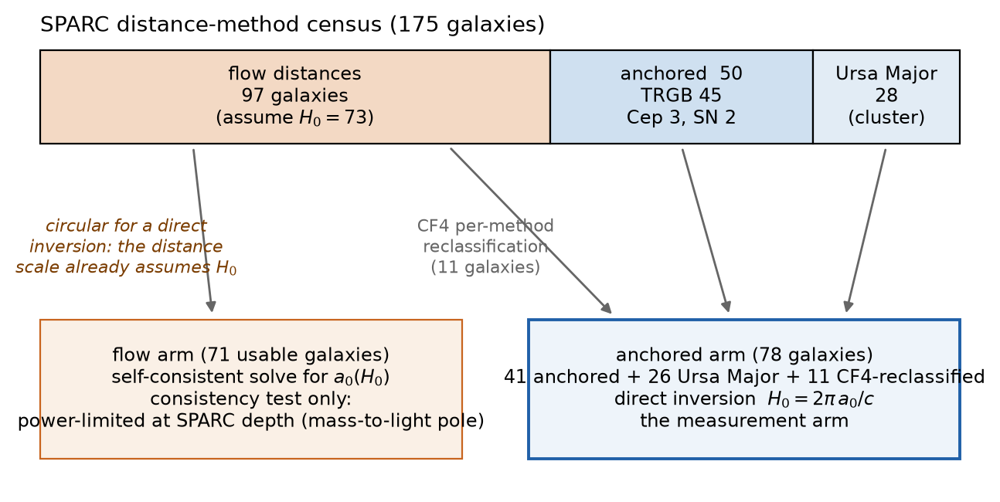
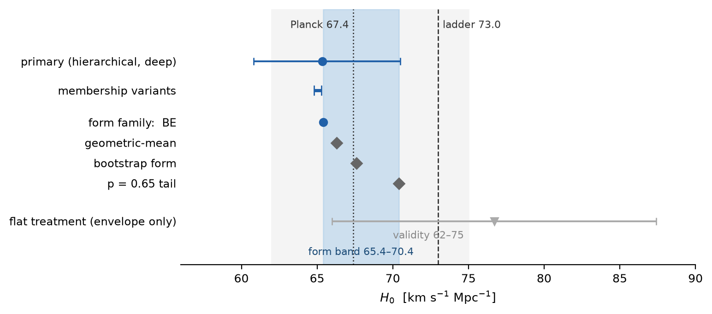
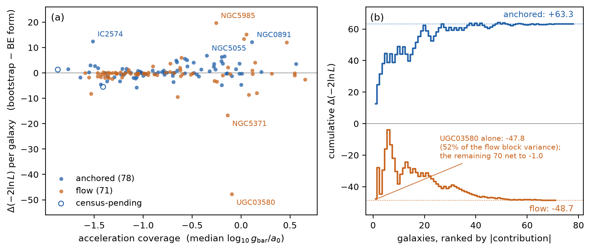
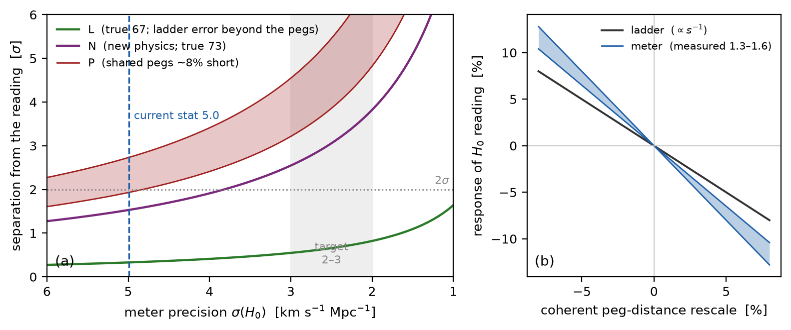
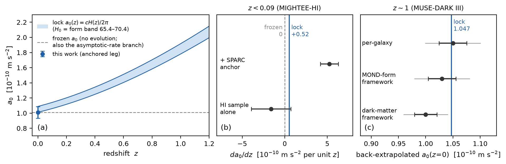

# A Hubble meter from galaxy rotation curves: first execution of the a0-to-H0 inversion

**Draft 0.2 — full prose (2026-09-22). Style contract: papers/STYLE.md.
Figures are built and gated by calcs/paperf_figures.py (provenance dump
data/paperf_figs.txt). Verification state: the SML20 quote set was
verified against the accepted arXiv v2 source on 2026-09-22 (residual:
cross-check the published AJ PDF at assembly); the reference list was
verified against arXiv/ADS/publisher pages the same day (one wrong
arXiv ID caught and corrected program-wide: Haslbauer et al. is
2009.11292, not 2008.07524). The census-pending pair was cleared and
KK98-251 closed by the stage-10X census leg (2026-09-22, same day).
The stage-10X battery is adopted (Round 50, 2026-09-22): section 6f
carries the influence list, the membership axes, and the two new
primary-side systematic rows (frozen bulge mass-to-light; galaxy-
level prior width) in the adopted wording. Remaining [ASSEMBLY]
blockers: (i) the AJ-PDF cross-check; (ii) abstract word count on
the final text. (The Ponomareva 2018 entry was verified 2026-09-23,
MNRAS 474, 4366; the Cadoni–Tuveri 2020 conditional reference was
resolved DROP — its abstract carries no a0(z) generalization, and
section 8 now owns the generalization as this program's registered
reading.) Guardrails from the stage
verdict files are restated in Appendix A and are binding on every
future edit.**

Author: Filip Hájek (independent researcher).

---

## Abstract

The radial acceleration relation of galaxies is governed by an
acceleration scale a0 whose measured value coincides with cH0/2pi. If
that identity is physical, rotation curves are a Hubble meter: a0,
measured from galaxy dynamics, returns H0 with no supernova rung and no
period–luminosity rung. We report the first execution of this inversion.
Because 97 of the 175 SPARC distances are Hubble-flow distances that
already assume H0 = 73, a whole-catalog inversion is circular; the
instrument is therefore built on the anchored subsample alone, 78
galaxies with tip-of-the-red-giant-branch, Cepheid, supernova, surface
brightness fluctuation, or cluster distances after a CosmicFlows-4
per-method reclassification; the flow subsample serves only as a
consistency arm. The anchored arm reads H0 = 65.4 +- 5.0 (statistical)
+- 0.5 (convergence) km/s/Mpc. The dominant systematic is not
statistical: the choice of the relation's functional form moves the
reading across 65.4-70.4, and we measure the levers of that band
directly. A per-galaxy preference map shows the flow subsample's
contrary form lean is carried by a single galaxy and sits below its own
scatter; an inner-angular-resolution cut resolves nothing and excludes
nothing while moving the anchored reading by at most 0.8. The meter
hangs from the same calibration pegs as the distance ladder but with
1.3-1.6 times the response, so at a precision of 2-3 km/s/Mpc it
separates a shared-peg systematic from new physics; at the current
precision it separates nothing. The method is timestamped for the
~4000-galaxy BIG-SPARC era, where the statistical term shrinks into
the deciding range.

---

## 1. Introduction

Rotation-curve dynamics at low acceleration are organized by a single
scale. The radial acceleration relation (RAR) maps the baryonic
(Newtonian) acceleration g_bar onto the observed acceleration g_obs
with remarkably small scatter (McGaugh, Lelli & Schombert 2016). The
scale a0 at which the two accelerations diverge has long been noted
to sit numerically at cH0/2pi (Milgrom 1983); Cadoni & Tuveri (2019)
derive both the relation's form and a0 = H/2pi in natural units from
horizon thermodynamics. A companion paper measures the coefficient
structure of that form on SPARC and finds the fitted acceleration
scale on the horizon value at sub-sigma agreement (Hájek 2026b,
section 5). Whatever the mechanism,
the identity has an operational consequence that appears to have gone
unused: it can be run backward. If a0 = cH0/2pi, then a galaxy
rotation curve is a Hubble meter, and a fit of the RAR to a sample
with H0-independent distances returns H0 = 2pi a0/c with no supernova
rung, no period-luminosity rung, and no flow model.

Three literature sweeps (2026, documented in the repository) found no
published execution of this inversion as a measurement. The forward
direction exists: van Putten (2026) evaluates a related identity at
fixed cosmological parameters and compares the result to the measured
a0. The nearest neighbor in data and intent is Schombert, McGaugh &
Lelli (2020), who measured H0 = 75.1 +- 2.3 (stat) +- 1.5 (sys) from
the baryonic Tully–Fisher relation, calibrated on 50 galaxies with
Cepheid (27) or TRGB (23) distances — stated by them as 30 drawn from
SPARC and 20 from Ponomareva et al. (2018) — and then applied outward
to the remaining 95 SPARC galaxies through CosmicFlows-3 velocities.
Their dominant quoted systematic (the +- 1.5) is the standard
deviation among flow models, which spans 72.8-77.5 across the four
velocity treatments they tabulate (including an uncorrected case they
themselves deem inadequate); in their words it "dominates the other
systematics". No acceleration scale enters their analysis; the radial
acceleration relation is cited only as background. [All quotes
verified against the accepted arXiv source, 2026-09-22; cross-check
the published AJ PDF at assembly.] The differentiation is direction:
the same catalog, run the opposite way. They ladder out through a
flow model; we invert the acceleration scale on the anchored
subsample with no flow model. The two instruments share calibration
pegs and fail in different places, which is what makes the comparison
useful.

This paper is the instrument: the circularity in the naive inversion
and its two-arm resolution (section 2), the first reading (section 5),
and the measured levers of its systematics (section 6). It is not an
H0 arbiter at the current precision, and no claim in it requires the
identity to be true; the reading is conditional on the identity by
construction, and section 9 states that conditionality plainly.

## 2. The circularity and the two-arm design

The naive inversion — fit the RAR to all of SPARC, read a0, divide —
is not a measurement of H0. The SPARC distance column is heterogeneous
(Lelli, McGaugh & Schombert 2016): of the 175 catalog galaxies, 97
carry Hubble-flow distances computed from recession velocities
assuming H0 = 73, 50 carry H0-independent anchors (tip of the red
giant branch, Cepheids, supernovae), and 28 share the Ursa Major
cluster distance. A whole-catalog fit inherits the assumed 73 through
the majority class: the answer would be built into the question. (We
measured this directly in the design stage; the whole-catalog reading
lands near 68, pulled between the assumed 73 and the anchored value,
and means nothing.)

The instrument therefore has two arms (Figure 1). The anchored arm
fits the RAR to the anchored subsample only and reads H0 = 2pi a0/c
directly; its distance errors are real distance errors, not a hidden
cosmology. The flow arm treats the flow subsample self-consistently:
its distances scale as 73/H0, so the fitted a0 becomes a function of
the assumed H0, and one solves for the H0 at which the fitted scale
equals cH0/2pi. Agreement between the arms is the design's internal
test; the identity has a reason to pass it, a numerical coincidence
does not. As section 5 reports, the flow arm turns out to be
power-limited at SPARC depth, so the internal test is deferred to
samples where its limiting degeneracy is absent by construction; the
anchored arm alone carries the measurement.

All analysis choices in this program are committed in advance: the
sample definitions, estimators, thresholds, and the wording of every
possible verdict are written to a public version-controlled repository
before each deciding fit is run (we call this bar-locking; the commit
chain timestamps every threshold). Each stage was then examined by an
adversarial review session, run as an AI model session rather than
human peer review. Every load-bearing finding of those sessions was
verified by independent recomputation before adoption, and all were
adopted in full; the downgrades this produced are part of the record
and are summarized in Appendix A.

*Figure 1. The distance-method census and the two-arm design. Top: the
175 SPARC galaxies by distance method; the 97 flow distances assume
H0 = 73 and cannot enter a direct inversion. Bottom: the anchored arm
(78 galaxies after the CosmicFlows-4 per-method reclassification of 11
flow galaxies and quality cuts; 41 individually anchored, 26 Ursa
Major, 11 reclassified) and the flow arm (71 galaxies with usable
curves), which serves only as a consistency test and is power-limited
at SPARC depth. Counts are parsed from the committed stage outputs by
the figure script.*

## 3. Data and sample

We use the SPARC database (Lelli, McGaugh & Schombert 2016): 175
late-type galaxies with Spitzer 3.6-micron photometry and HI/Halpha
rotation curves, with published per-point velocity errors and baryonic
mass models. The standard quality cuts (inclination >= 30 degrees,
quality flag Q <= 2) leave 153 galaxies; the stellar mass-to-light
conventions are the catalog's (disk 0.5, bulge 0.7 at 3.6 micron),
with the disk value refit globally as described in section 4.

The anchored subsample was then extended by a per-method pass through
CosmicFlows-4 (Tully et al. 2023 [ASSEMBLY: verify entry]). Eleven
flow galaxies have CF4 per-method distances of anchor grade (nine
TRGB, one surface-brightness-fluctuation, one Type II supernova),
which replaces 15-30 percent flow-distance errors with 4-9 percent
anchor errors. Two safeguards from the review of that stage apply.
The CF4 per-method moduli are used, never the combined modulus, which
mixes Tully–Fisher and fundamental-plane information and would be
dynamically circular. And CF4's own H0 = 74.6 is nowhere imported:
the moduli sit on the calibrator common scale (Milky Way parallaxes,
the LMC, and the NGC 4258 maser), a fact that matters again in
section 6d. The Ursa Major block is kept with a single shared distance
nuisance; its two members with direct CF4 Cepheid distances straddle
the block distance and are carried as a frozen cross-check. Four
LITTLE THINGS dwarfs with CF4 TRGB anchors were candidates for
inclusion and were excluded by a pre-registered compatibility clause.
Their velocity fields agree with SPARC's to 0.05 dex where the
surveys overlap, but their published baryonic models sit one-sidedly
0.13 dex low against SPARC's photometric ones (7 of 7 overlap medians
negative). They enter as cross-checks only; all cross-check readings
are 65.1-65.4, within 0.2 of the primary.

The final anchored arm is 78 galaxies: 41 individually anchored, 26
Ursa Major, 11 CF4-reclassified. Two anchored galaxies (D564-8,
D631-7) carried provenance-review flags through the map stage.
Positional cross-matching places them at PGC 86668 (0.16 arcmin) and
PGC 22277 (0.43 arcmin); each carries a CF4 tip-of-the-red-giant-
branch modulus agreeing with the SPARC distance to 1.8 and 0.4
percent. Because the SPARC distances for these two are themselves
TRGB-based, this confirms the identification and the anchor grade
(which is what was pending) rather than providing an independent
distance; both flags are cleared on that basis. The released
per-galaxy table and Figure 3 retain the flags as of the map stage.
One flow-subsample object inside the reclassification band, KK98-251,
remains unresolved at the registered 3-arcmin matching radius, with
one group-consistent TRGB candidate just outside it (PGC 64824 at
5.6 arcmin, in the NGC 6946 group, 6.98 Mpc against the SPARC flow
distance 6.80 +- 2.04); it stays a flow member, deferred to the next
census pass.

## 4. Method

The estimator is a hierarchical fit of the RAR to the anchored arm.
Per galaxy, the model carries a distance nuisance (prior width = the
published distance error; the Ursa Major members share one draw) and
an inclination nuisance (published error); globally, it carries the
disk mass-to-light ratio, an intrinsic scatter, and the acceleration
scale a0. The likelihood is evaluated on the ~1,300 rotation-curve
points that survive the per-point velocity-error cut, with the
published errors propagated. The fit is refit to convergence with a
deep alternation (the initial stage used a looser schedule; the
difference, about 1 km/s/Mpc, is the origin of the quoted convergence
term). A flat-treatment variant (no per-galaxy nuisances, single
global mass-to-light) is retained as a treatment envelope and is never
the statistic: the two treatments sit on opposite sides of the
mass-to-light/a0 degeneracy that the hierarchical model is built to
break, and the primary treatment was declared before any sky fit.

The functional-form family is fixed in advance: the Bose–Einstein form
(the derived identity of Cadoni & Tuveri, and the best-fitting form on
this subsample), and three measured alternatives spanning the
plausible transition-sharpness range from the companion program (a
sharper-tail variant, a geometric-mean construction, and a
self-consistent bootstrap form). H0 is read at each member; the family
span is the dominant systematic and is reported as a band, never
folded into the error bar (section 6a).

Uncertainties are engine-matched: the quoted statistical error is the
galaxy bootstrap of the primary estimator itself (200 resamples with
distance jitter and a shared Ursa Major draw), a rule adopted after a
review session found the initial run had attached the flat engine's
dispersion to the hierarchical central, overstating the error by a
factor of two (Appendix A). The bootstrap resamples whole galaxies
rather than points because within-curve residuals are strongly
correlated (measured near 0.6 in this program), which makes
point-level error estimates optimistic; galaxy-block resampling
absorbs that correlation. Injection tests validate the estimator as
unbiased for true H0 in 62-73; at a true value of 85 it carries a
measured -3.0 +- 0.7 percent one-sided bias, so the quote is valid for
readings up to about 75 and any future reading above that requires
recalibration first. One scope note attaches: the injection arm draws
its per-galaxy nuisance offsets from the priors the fit assumes, so
the validation is conditional on that generative family and is not a
defense against prior mis-specification (section 6f measures that
axis directly; a sky-matched re-run of the injection arm is booked in
the record). Every fit in the program executes on a
deterministic worker pool certified bit-identical to serial execution
at two pool widths, and all pre-registrations, thresholds, and review
adoptions are in the public repository.

## 5. First light: the anchored arm

The anchored arm reads

  H0 = 65.4 +- 5.0 (stat) +- 0.5 (convergence) km/s/Mpc,

with bootstrap percentiles (16/50/84) of 60.8/65.4/70.5 and a
convergence plateau of 64.9-65.9 across three independent optimizer
implementations (Figure 2). Membership variants span 64.8-65.4:
moving the Ursa Major Cepheid pair to its own distances gives 65.3,
and a uniform-CF4 variant (every CF4-bearing member swapped to its
CF4 distance) gives 64.8. Composition slices are stable within one
sigma, including the gas-dominated/star-dominated split (0.33 sigma).
The reclassified galaxies moved the converged central by +0.1: the
CF4 anchors are collectively consistent with what the flow distances
already said, which is itself a useful null. The flat-treatment
variant reads 76.7 with a dispersion of 10.7; that pair is quoted
only as the treatment envelope (the hierarchical/flat split is the
known mass-to-light degeneracy, and the hierarchical treatment is the
pre-registered primary). A single-realization floor of about 2.4
km/s/Mpc (the seed scatter of injection recoveries at survey depth)
is part of the statistical term, not additional to it.

The flow arm returned no reading, for a structural reason worth
reporting. With star-dominated galaxies, the self-consistent solve
sits close to a pole of the estimator: the fitted mass-to-light ratio
absorbs a distance rescale at nearly the rate the identity supplies,
which makes the arm a sevenfold error amplifier. The bootstrap
crosses the pole in roughly a quarter of resamples, so no finite
variance exists at SPARC depth. The internal agreement test is
therefore deferred to gas-dominated flow samples (WALLABY-class),
where the mass-to-light pole is absent by construction. We quote no
number from the flow arm.

*Figure 2. The anchored-arm reading. The primary hierarchical fit
with its bootstrap 16-84 interval; the membership-variant span; the
four functional-form members (the 65.4-70.4 band, shaded); and the
flat-treatment variant with its dispersion, which is an envelope on
the treatment split, not a statistic. The light backdrop is the
injection-validated domain (62-75). Dotted and dashed lines mark the
Planck CMB value 67.4 +- 0.5 (Planck Collaboration 2020) and the
distance-ladder value 73.0 +- 1.0 (Riess et al. 2022). Every plotted
value is parsed from the committed stage outputs.*

## 6. Systematics: the measured levers

### 6a. The functional-form band

Reading H0 at the four family members gives 65.4 (Bose–Einstein),
66.3 (geometric mean), 67.6 (bootstrap form), 70.4 (sharper tail):
the band 65.4-70.4 exceeds the statistical term and is the meter's
bottleneck. A dedicated contest on the anchored arm demoted the
bootstrap form at report grade (about 2 sigma by paired galaxy
bootstrap; a permutation construction agrees) but could not separate
the band's edges at N = 78 under any defensible calibration; the
geometric-mean member survives because the data refuse its rejection
at 1.26 sigma, short of the pre-registered bar. The review of that
stage found the contest's injection-calibrated significance bars had
inherited an unvetted noise model: intrinsic scatter 3.85 times the
sky-fitted value, and no within-curve correlation where the sky
measures 0.62. Those two errors cancelled in the separation estimate
and compounded in its spread. The band therefore stands on the
uncalibrated statistics alone, and the smaller sample-size forecasts
the injection model implied were retracted. The contest's evidence is
also concentrated: a refit jackknife shows two galaxies (IC 2574 and
NGC 891) carry roughly 43 and 68 percent of the two demotion leads
(an effective sample of 5-10 galaxies), and only a weak majority of
galaxies (44-51 of 78, construction-dependent) favors the winning
form. The honest requirement for pinning the form is N of order
100-1000 (section 7).

### 6b. The per-galaxy preference map

Because the form band is the bottleneck, we built a per-galaxy map of
it (Figure 3; the full table is released as data/stage10w_map.csv).
Holding the global parameters of each fit fixed, each galaxy's
contribution to the form preference is decomposed exactly (the
per-galaxy contributions close on the engine totals by construction).
Three facts follow.

First, the anchored arm's preference for the Bose–Einstein form is
broad: 78 galaxies accumulate +63.3 units of Delta(-2 lnL) against
the bootstrap form, the largest single carrier (IC 2574) holding 37
percent of the block variance.

Second, the flow subsample's contrary lean — the one hint in this
program that a different form might fit elsewhere — is one galaxy.
UGC 3580 contributes -47.8 of the flow total of -48.7 (52 percent of
that subsample's block variance); the remaining 70 flow galaxies net
to -1.0. The lean itself is 0.71 of the subsample's own realized
galaxy-block scatter: below noise before any interpretation.

Third, composition is not an axis. Across four registered axes
(acceleration coverage, gas fraction, inner angular resolution,
subsample membership) tested with a rank-based partial-correlation
machinery under a coverage-conditioned permutation null, gas fraction
carries nothing beyond acceleration coverage (partial p = 0.54), and
no axis reaches an established grade once the family of tests is
accounted for. The map itself is robust to the construction (rank
correlation 0.926 between per-galaxy decompositions at the two
subsample optima); only the axis grades move.

*Figure 3. The per-galaxy form-preference map (released as
data/stage10w_map.csv). (a) Each galaxy's contribution to the
bootstrap-versus-Bose–Einstein preference at fixed global parameters,
against its acceleration coverage; positive values prefer the
Bose–Einstein form. Open symbols mark two galaxies whose distance
provenance was under review at map time (both flags subsequently
cleared against CF4 TRGB distances; section 3). (b) Cumulative contributions ranked by size: the anchored
subsample's preference accumulates broadly to +63.3, while the flow
subsample's contrary lean is a single galaxy (UGC 3580, 52 percent of
its block variance); the remaining 70 flow galaxies net to -1.0.*

### 6c. The inner-angular-resolution lever

The innermost rotation-curve points of the flow subsample subtend
smaller angles than the anchored subsample's (median innermost radius
15 versus 35 arcsec), so inner angular resolution was the named rival
explanation for the flow lean. We cut every rotation-curve point
inside 10, 20, and 30 arcsec (galaxies leave the sample only when
fewer than three points survive), recomputed each subsample's
realized scatter in each cut world, and re-read the preferences. The
result, in the adopted wording of the review session: the lever moves
the anchored subsample's form preference by at most 0.10 of its own
scatter and the flow subsample's by at most 0.30 of its own, in a
direction that reverses between 20 and 30 arcsec; it resolves nothing
and excludes nothing, and it costs the anchored acceleration scale
0.8 km/s/Mpc in H0.

The details carry the information. The anchored Bose–Einstein
preference survives every cut at 2.4-2.7 sigma of its own block
scatter (+63.3 uncut becomes +63.5, +66.0, +61.8), so the meter's arm
is not an inner-resolution artefact; its fitted H0 moves to 64.5 at
the 20-arcsec cut (a sensitivity statement, never a reading — the
quoted band and statistical error are uncut-arm properties and do not
move). The flow lean wanders from -48.7 to -31.7, -29.7, -54.2 across
the cut grid, and every level and every cut-induced move is below
that subsample's own scatter (0.36-0.95 sigma). A paired galaxy
bootstrap gives P = 0.62, against a 0.95 bar, that the cut moves the
lean toward the anchored subsample's preferred form. The apparent
reversal at 30 arcsec is a point-cut effect, not a population change:
holding the galaxy population fixed and cutting only the points
reproduces -30.3 of it, and the seven galaxies the 30-arcsec cut
ejects carry -0.6 of the -24.5 swing. Most tellingly, the carrier is
unstable while the total is not: UGC 3580's share of the flow block
variance runs 52, 46, 14, 0 percent across the grid while the total
stays inside -30 to -54. An unstable decomposition under a stable
total is the signature of noise, not of a carrier. Inner angular
resolution is therefore neither established nor excluded as the
source of a residue that is itself sub-noise.

One directional diagnostic survives with a footprint worth recording:
galaxy-paired inner-minus-outer residuals at 20 arcsec show an inner
depression on the anchored subsample (-0.086 +- 0.030 dex, 2.9 sigma)
and none on the flow subsample (-0.004 +- 0.018). The rival was
invented for the flow subsample and has no footprint on it; whatever
the inner depression is (beam smearing and radial misfit are
degenerate here), it lives on the arm whose form preference the cut
leaves intact. This diagnostic is the registered successor instrument
for the resolution question.

### 6d. Peg sharing and gearing

The meter is independent of any assumed H0, but it is not independent
of the distance calibrators: the CF4 per-method moduli sit on the
same calibrator common scale as the distance ladder itself (Milky Way
parallaxes, the LMC, the NGC 4258 maser). The response is what
differs. A coherent peg-distance rescale moves the ladder's H0 as the
first power; the meter's fitted a0 responds as roughly the second
power in the deep limit, and its measured response on this sample is
1.3-1.6 (Figure 4b). Shared pegs, different gearing, same direction:
that combination is what makes the meter a discriminant rather than a
replica.

Figure 4a scores the reading against the live explanations of the
Hubble tension. A world where the tension is a ladder error beyond
the shared pegs (true H0 near 67) sits 0.3 sigma from this reading; a
new-physics world (true H0 near 73, pegs fine) sits 1.5 sigma; a
world where the shared pegs are about 8 percent short predicts the
meter reads above the ladder, 75-79, and sits 1.9-2.7 sigma. A low
meter reading is the specific signature that disfavors the shared-peg
explanation, because the gearing would push a peg-driven meter high,
not low. Nothing is excluded at this precision, and the form band
spans the first two worlds' gap; the figure's content is that at
sigma = 2-3 km/s/Mpc the meter separates what no same-peg ladder
re-measurement can. A local-void world (the differential-expansion
class) predicts the new-physics central value but with structure the
uniform world lacks, a radial gradient and a dipole in the fitted a0;
that discriminant is a registered hemisphere instrument left to
future work.

*Figure 4. (a) Separation between the current central value and the
three tension worlds as a function of meter precision: L (ladder
error beyond the shared pegs, true 67), N (new physics, true 73), P
(shared pegs ~8 percent short; the meter's 1.3-1.6 gearing then
predicts a reading of 75-79). At the current sigma = 5.0 the worlds
sit at 0.3, 1.5, and 1.9-2.7 sigma; the functional-form band
(section 6a) caps discrimination until it is pinned. (b) The gearing:
response of each instrument's H0 to a coherent rescale of the shared
calibration pegs; the ladder responds as the first power, the meter's
measured response is 1.3-1.6 times steeper, same direction.*

### 6e. Conventions disclosed

Three conventions are fixed throughout and disclosed. The bulge
mass-to-light ratio is 0.7; a robustness battery run for this paper
promoted it from a disclosed convention to a named systematic of the
central (section 6f). The global disk mass-to-light ratio carries no
prior (it is fit; the anchored arm fits it at 1.05). The Ursa Major
block shares one distance nuisance, whose fitted shift is -0.021 dex
against a 2.3 Mpc block depth; the two direct-Cepheid members
straddle it.

### 6f. The robustness battery: influence, membership, and the prior

A pre-registered diagnostic battery ran the referee-grade axes on the
anchored central; its verdict grammar was itself corrected on
adversarial review (Appendix A), and everything quoted here is the
adopted, re-verified form.

Influence. No single galaxy moves the anchored central by more than
2.25 km/s/Mpc (NGC 5907, 0.45 of the statistical error); the median
leave-one-out shift is 0.22 and the 90th percentile 1.09, and the
implied jackknife error (5.3) agrees with the bootstrap (5.0).
Influence concentrates where a distance-quality-weighted estimator
should concentrate it: the leave-one-out shift correlates with point
count (Spearman +0.41) and inversely with the adopted distance-prior
width (-0.57), and not with acceleration coverage (+0.05).

Membership. Inclination cuts at 40, 45 and 50 degrees move the
central by +0.28, +0.21 and +1.64 km/s/Mpc, within the measured
random-subset scatter at those sizes (0.89 at N = 74, 2.40 at
N = 63). Restricting to quality flag Q = 1 (46 galaxies) moves it by
+4.35 against a measured random-subset scatter of 5.24: at that
sample size the cut is uninformative either way. Dropping the 12
galaxies with a bulge component moves the central by -5.87, a
2.8-sigma deviation against the measured subset scatter (2.10; none
of 40 random 66-galaxy subsets deviates as far) - and the shift is an
acceleration-coverage effect, not a bulge-population effect: those 12
galaxies supply 64 percent of the points above the acceleration scale
and all seven above ten times it, and removing only the points above
the scale, keeping all 78 galaxies, reproduces the shift at -6.07.
In the deep regime mass normalization and the acceleration scale
trade one-for-one; only data above the transition break the
degeneracy, and most of that data lives in the bulged galaxies.

Two systematic rows follow, both properties of the primary.

The frozen bulge mass-to-light. The meter moves +12.5 km/s/Mpc per
unit change in the bulge mass-to-light ratio, so the conventional
+-0.1 range around 0.7 is worth +-1.3 on the central - larger than
the membership band and 2.6 times the convergence term. The fit's
own profile mildly prefers about 0.55 (roughly 2 sigma after
correcting the formal curvature for the measured overdispersion),
which would read 63.5; the bulge-free membership axis stops firing
below about 0.57, so its verdict is conditional on the convention.

The galaxy-level prior width. Widening the per-galaxy distance-and-
inclination prior by 50 percent moves the central by +1.18 km/s/Mpc
(the local gradient is about +2 per e-fold). The response is
directional - in mock skies drawn from the estimator's own prior it
is +0.30 +- 0.37 - and the fitted per-galaxy offsets are 1.70 times
wider than the prior allows (19 of 78 beyond two sigma, 9 beyond
three, where 3.6 and 0.2 are expected). At the prior width that
makes the offsets self-consistent the central reads 69.5; matched
injections show the too-tight prior inflates realization scatter
rather than biasing the central, so that value is a realization, not
a correction, and the prior-width choice enters the budget as a
model axis. The disk mass-to-light prior width is a weak axis by
contrast (+0.11 to +0.29 over the same ladder).

Both rows are smaller than the functional-form band, which remains
the dominant systematic; both are now in the budget by measurement
rather than by assumption.

## 7. Forecast and the BIG-SPARC timestamp

The statistical term at N = 78 is 5.0 km/s/Mpc. The honest
requirement for arbitrating the form band is N of order 100-1000
(measured from the contest's own separation scaling; smaller
forecasts from the retracted injection model are not quoted). Two
developments meet that requirement. Near term, gas-dominated flow
samples (WALLABY-class) revive the consistency arm: gas dominance
removes the mass-to-light pole that power-limits it at SPARC depth.
Decisive, BIG-SPARC (~4,000 homogeneous galaxies, in preparation;
Haubner et al., arXiv:2411.13329 [ASSEMBLY: verify entry]) brings
twenty times the sample. Its distance choices will embed an H0
exactly as SPARC's do, which is why this paper timestamps the
provenance-split design now: the census, the per-method
reclassification pass, the two-arm architecture, and the validity
domain are the instrument a BIG-SPARC-era inversion needs on day one.

## 8. The redshift axis

The identity generalizes: a0(z) = cH(z)/2pi rises with redshift, and
the rise is parameter-free once H0 is set (about +0.5 x 10^-10 m/s^2
per unit redshift at low z). The generalization is this program's
registered reading, not a published derivation: the Cadoni & Tuveri
result is derived in a static de Sitter setting, and which expansion
rate the identity tracks at finite redshift is the branch choice
discussed below. Both epochs measured so far lean the
lock's way (Figure 5).

At z < 0.09, the MIGHTEE-HI evolution fit (Varasteanu et al. 2026)
brackets the prediction. Their HI-selected sample alone gives
da0/dz = -1.60 +- 2.33, which contains both zero and the lock and
separates them at no useful grade. Their SPARC-anchored fit gives
+5.23 +- 1.05, sign-agreeing with the lock and sitting 4.5 sigma
above it at face value; but the rise it implies across their window
equals, to within 15 percent, the zero-point offset between their own
two subsamples, so slope and inter-sample calibration are not
separated by that lever arm. At z ~ 1, the MUSE-DARK III
rotation-curve sample (Ciocan et al. 2026) back-extrapolates to
a0(z=0) rows that contain the lock intercept in two of their three
frameworks (0.7 and 0.1 sigma; the dark-matter framework row sits 2.3
sigma away). Their slope comparison is limited by what the release
contains and is not reproducible from the public products (Hájek
2026b, section 5.1, documents the attempt).

The comparison discriminates among rival scalings already: the
measured sign at both epochs is a rise, where the van Putten (2026)
geometric identity predicts a falling a0(z), Gillot's construction is
sign-separable the same way, and a frozen a0 predicts zero. The
redshift axis is the cleanest external discriminant the identity has,
and it is live now.

One branch ambiguity belongs to this section rather than to the
error budget. The identity can be read with the instantaneous Hubble
rate H(z), the registered primary used throughout, or with the
asymptotic de Sitter rate H0 sqrt(Omega_Lambda) ~ 0.84 H0, which is
constant in redshift. The branch changes the meter's conversion:
under the asymptotic reading the same fitted acceleration scale
implies H0 ~ 78 (form band 78-84, the factor 1/sqrt(0.7) = 1.195),
a value that would sit above the ladder and outside the meter's
validated domain, requiring recalibration before it could even be
quoted. The redshift axis is what separates the branches: the
asymptotic rate predicts a z-flat a0 (the dashed line of Figure 5a),
and both measured epochs lean the rising way. The z-axis therefore
polices the conversion branch as well as the rivals.

*Figure 5. The redshift axis. (a) The lock prediction a0(z) =
cH(z)/2pi with H0 spanning this paper's form band (shaded), a frozen
a0 (dashed; this line is also the asymptotic-rate branch of the
identity, section 8), and this measurement at z = 0. (b) Evolution-rate
comparison over the MIGHTEE-HI window (z < 0.09; Varasteanu et al.
2026, values verbatim): their two fits against the lock secant
(+0.52) and zero. (c) The z ~ 1 test: back-extrapolated a0(z=0) from
MUSE-DARK III (Ciocan et al. 2026) in three frameworks against the
lock intercept at their adopted cosmology; thick and thin bars are 1
and 2 sigma, converted from the published 95 percent intervals.
Panels use each comparison's declared cosmology (documented in the
figure script).*

## 9. Discussion

What the meter is today: the first executed inversion of the
acceleration scale into a Hubble constant, reading 65.4 +- 5.0
(stat) +- 0.5 (convergence) with a functional-form band of 65.4-70.4,
on 78 anchored galaxies, unbiased over the validated domain 62-75.
The reading is Planck-adjacent and separates none of the live Hubble
tension worlds at this precision; the two statements above are the
operative pair and no headline should compress them into one number.

What it becomes at sigma ~ 2-3 km/s/Mpc: a referee with different
systematics from every existing route. No supernova rung, no
period-luminosity rung, no flow model; the same calibration pegs as
the ladder but with 1.3-1.6 times the response, so a peg systematic
drags the two instruments apart instead of together. The path to that
precision is sample size and form-pinning, both of which BIG-SPARC
supplies, plus the gas-dominated flow samples that revive the
internal consistency arm.

Conditionality and credence. The reading is conditional on the
identity a0 = cH0/2pi being physical; this paper presents an
instrument, not evidence for the identity (the companion papers carry
the measurements that motivate it, and their support is coefficient-
level, not H0-level). The program behind this work tracks its own
credence numerically as a matter of policy: the standing figure for
the underlying low-acceleration anomaly being real physics is about
53 percent, unchanged by any result here — an instrument's first
light should not move belief in the physics it presumes. Honest nulls
attach: the meter implies no age-of-universe consequence at this
precision, supplies no relativistic completion, and inherits the
exponential solar-system screening of the measured function class
(Hájek 2026b, section 9).

Three caveats bound the claim. The anchored arm is anchored, not
assumption-free: a coherent error in the shared calibrator pegs moves
this reading 1.3-1.6 times as fast as it moves the ladder (that
gearing is the design's discriminating feature, and also its
exposure). The functional-form band is a physics systematic, not a
statistical one: no amount of resampling shrinks it; only a larger
sample can pin the form, and section 6 shows the in-sample levers
(composition, resolution) do not. And the conversion itself carries a
branch choice (section 8): the registered primary reads the
instantaneous H(z); the asymptotic-rate alternative would multiply
the reading by 1.195 and is sign-disfavored by the measured redshift
lean, but it is a reading choice, not a measured fact.

## 10. Conclusions

1. The a0-to-H0 inversion has been executed as a measurement for what
appears to be the first time. The instrument's design problem is a
circularity: most SPARC distances already assume an H0. The
resolution is a provenance split with a direct anchored arm and a
self-consistent flow arm.

2. The anchored arm (78 galaxies) reads H0 = 65.4 +- 5.0 (stat) +-
0.5 (convergence) km/s/Mpc, with membership variants spanning
64.8-65.4, validated unbiased over 62-75. The flow arm is
power-limited at SPARC depth by a mass-to-light pole and returns no
number.

3. The dominant systematic is the functional form of the radial
acceleration relation: 65.4-70.4 across the pre-registered family.
Its levers were measured directly. The flow subsample's contrary form
lean is one galaxy (52 percent of that subsample's block variance)
and sits at 0.71 of its own scatter. Gas fraction carries nothing
beyond acceleration coverage. An inner-angular-resolution cut moves
the anchored preference by at most 0.10 of its scatter, the flow lean
by at most 0.30 of its own, and the anchored H0 by at most 0.8
km/s/Mpc, resolving and excluding nothing.

4. The meter shares its calibration pegs with the distance ladder at
1.3-1.6 times the response. At sigma = 2-3 km/s/Mpc that separates a
shared-peg systematic (meter reads 75-79) from new physics (meter
reads 73) from a beyond-the-pegs ladder error (meter reads 67); at
the current precision the worlds sit at 1.9-2.7, 1.5, and 0.3 sigma
and nothing is excluded.

5. The identity's redshift generalization, a0 rising as cH(z)/2pi, is
sign-supported at both measured epochs and sign-opposed by the
published rival scalings; it is the cleanest external test and needs
no new instrument.

6. The design is timestamped for BIG-SPARC. Its ~4,000 galaxies
shrink the statistical term into the deciding range, and its distance
choices will need exactly this provenance split.

## Acknowledgments

This work was carried out in an extended collaboration with Claude
(Anthropic), which contributed analysis code, verification passes,
and drafting under the author's direction. The collaboration
statement and the full pre-registration chain are in the public
repository. The adversarial review sessions cited throughout were AI
model sessions, not human peer review; every load-bearing number they
produced was re-verified by independent scripts before adoption. This
paper has not yet undergone journal peer review.

## Appendix A: transparency and corrections

The program logs its corrections publicly; the five review sessions
behind this paper (one per stage: design, anchored extension, form
contest, stratification, map and resolution cut) produced the
following adopted downgrades, listed so they cannot be un-learned:

- The design stage's as-fired two-arm agreement statement was
  downgraded to consistent-but-uninformative: 73 percent of the
  tested window would have passed the agreement bar. Two early error
  strings from that stage (a two-arm H0 with a combined error, and a
  flow-arm dispersion of 11.58) are retracted and never quoted; the
  flow arm has no finite variance at SPARC depth.
- The anchored extension was initially quoted at half its real
  sharpness: the flat engine's dispersion (10.7) had been attached to
  the hierarchical central. The engine-matched bootstrap gives 5.0,
  and the health check that would have caught it is now always
  evaluated, never just printed. The same review strengthened the
  injection arm, which exposed the one-sided edge bias at true
  H0 = 85 and produced the 62-75 validity domain.
- The form contest's injection-calibrated significance bars inherited
  an unvetted noise model (intrinsic scatter 3.85 times the sky value;
  no within-curve correlation against a measured 0.62); the two errors
  cancelled in the separation estimate and compounded in its spread.
  The band conclusion stands on the uncalibrated statistics; the
  injection-based sample-size forecast (a factor ~4 too optimistic)
  was retracted.
- The stratification stage's headline reading (an apparent
  cross-subsample form inversion) was relabeled on review: the object
  had never passed the stage's own scatter rule (0.71 sigma) and is
  one-galaxy-carried. What survived is in section 6b.
- The map-and-cut stage's registered verdict grammar was found
  degenerate (two verdict branches both satisfied, the printed one
  selected by code order, one branch pre-satisfied by the uncut
  data); the verdict was relabeled to the neither-established-nor-
  excluded form quoted in section 6c. The same review found the
  fitting engine re-initializes per-galaxy nuisances on cut-world
  refits, stalling 5.5-11.8 likelihood units short on those worlds
  only; all cut-world numbers quoted here are the corrected, profiled
  values (the reviewer's endpoint was reproduced to the third
  decimal), the uncut fits were verified at their profiled optima to
  0.01, and one subsample scatter was corrected (66.0 to 64.3).
- The robustness battery's verdict was corrected on review: one of
  its three firing axes (a leave-one-out maximum graded against a
  single-draw band) was struck as a mis-specified order-statistic
  bar that would fire with 97 percent probability under its own
  null, and the surviving verdict was re-scoped from a
  subset-fragility statement to the two named primary-side
  systematics of section 6f. A census over-claim for one unmatched
  flow galaxy ("closed") was withdrawn to deferred-candidate status.
  Every reviewer number was re-verified by independent scripts
  before adoption.

Standing guardrails bound at the stage verdicts and binding on this
text:

- no flow-arm H0 is ever quoted;
- the flat-treatment dispersion is an envelope, never a statistic;
- cut-world acceleration scales are never quoted as readings (their
  implied H0, 77-84, sits outside the validity domain);
- the form band and the statistical error are never compressed into
  one number;
- the per-galaxy map's axis grades are quoted only with their
  conditioning stated.

## Appendix B: reproducibility

Every quoted number is produced by a named script against the public
repository; verdict files carry the operative wording. One row per
instrument:

| Quantity | Script | Output |
|---|---|---|
| distance-method census (97/50/28) | calcs/stage10s_h0meter.py | data/stage10s_h0meter_gates.txt |
| design-stage verdicts + retractions | calcs/stage10s_skyread.py | data/stage10s_verdict.txt |
| anchored-arm reading, variants, validity domain | calcs/stage10t_legregrow.py | data/stage10t_skyread.txt, data/stage10t_verdict.txt |
| functional-form contest and band | calcs/stage10u_nuform.py | data/stage10u_verdict.txt |
| stratification and its relabel | calcs/stage10v_strat.py | data/stage10v_verdict.txt, data/stage10v_flowboot.txt |
| per-galaxy map, resolution cut, carrier rotation | calcs/stage10w_map.py | data/stage10w_verdict.txt, data/stage10w_map.csv |
| review verifications (blind + post-report) | calcs/round45_addendum.py .. calcs/round49_gb.py | data/round45_addendum.txt .. data/round49_addendum.txt |
| deterministic worker pool certificate | calcs/fitpool.py | data/fitpool_gate.txt |
| low-z evolution comparison | data/lit0818_a0z.py | data/lit0818_a0z.txt |
| z ~ 1 intercept comparison | calcs/stage10h_addendum.py | data/stage10h_addendum.txt |
| all five figures (gated) + the conversion-branch arithmetic | calcs/paperf_figures.py | papers/figs/figf1-5, data/paperf_figs.txt |
| robustness battery + census leg (sections 3, 6f) | calcs/stage10x_meterrobust.py | data/stage10x_battery.txt, data/stage10x_verdict.txt |
| battery verification (blind + post-report) | calcs/round50_ga.py, calcs/round50_gb.py | data/round50_ga.txt, data/round50_gb.txt |

## References

[ASSEMBLY: verify every entry against ADS/arXiv before submission;
entries marked (v) were verified in earlier papers of this program.]

- Cadoni M., Tuveri M., 2019, Phys. Rev. D 99, 084042
  (arXiv:1904.11835). (v)
- Ciocan B. I., et al., 2026, MUSE-DARK III (arXiv:2604.22613). (v)
- Gillot J., 2026, Eur. Phys. J. C, accepted (arXiv:2507.11524). (v)
- Hájek F., 2026a, wide-binary companion paper (Zenodo DOI
  10.5281/zenodo.22050990 concept). (v)
- Hájek F., 2026b, RAR-coefficients companion paper (same record). (v)
- Anand G. S., Rizzi L., Tully R. B., et al., 2021, AJ 162, 80
  (arXiv:2104.02649; the EDD TRGB catalog). (v)
- Haslbauer M., Banik I., Kroupa P., 2020, MNRAS 499, 2845
  (arXiv:2009.11292). (v) [ID corrected 2026-09-22: the program
  record briefly carried 2008.07524, an unrelated paper]
- Haubner K., et al., 2024, arXiv:2411.13329 (BIG-SPARC; IAU Symp.
  392 proceedings; the database itself is in preparation). (v)
- Lelli F., McGaugh S. S., Schombert J. M., 2016, AJ 152, 157. (v)
- McGaugh S. S., Lelli F., Schombert J. M., 2016, PRL 117, 201101. (v)
- Migkas K., et al., 2021, A&A 649, A151 (arXiv:2103.13904). (v)
- Milgrom M., 1983, ApJ 270, 365. (v)
- Planck Collaboration, 2020, A&A 641, A6. (v)
- Ponomareva A. A., Verheijen M. A. W., Papastergis E., Bosma A.,
  Peletier R. F., 2018, MNRAS 474, 4366 (arXiv:1711.09112). (v)
- Riess A. G., et al., 2022, ApJL 934, L7 (arXiv:2112.04510). (v)
- Schombert J., McGaugh S., Lelli F., 2020, AJ 160, 71
  (arXiv:2006.08615). (v — every quoted number verified against the
  accepted arXiv v2 source 2026-09-22; the 30/20 SPARC/Ponomareva
  split is their stated split, tables enumerate 29+21; cross-check
  the published AJ PDF at assembly)
- Secrest N. J., et al., 2021, ApJL 908, L51. (v)
- Tully R. B., Kourkchi E., Courtois H. M., et al., 2023,
  Cosmicflows-4, ApJ 944, 94 (arXiv:2209.11238; publisher year
  verified 2026-09-22). (v)
- van Putten M. H. P. M., 2026, MNRAS 548 (arXiv:2608.07112). (v)
- Varasteanu T., et al., 2025, arXiv:2504.20857. (v)
- Varasteanu T., et al., 2026, MIGHTEE-HI/LADUMA evolution
  (arXiv:2608.03576). (v)
